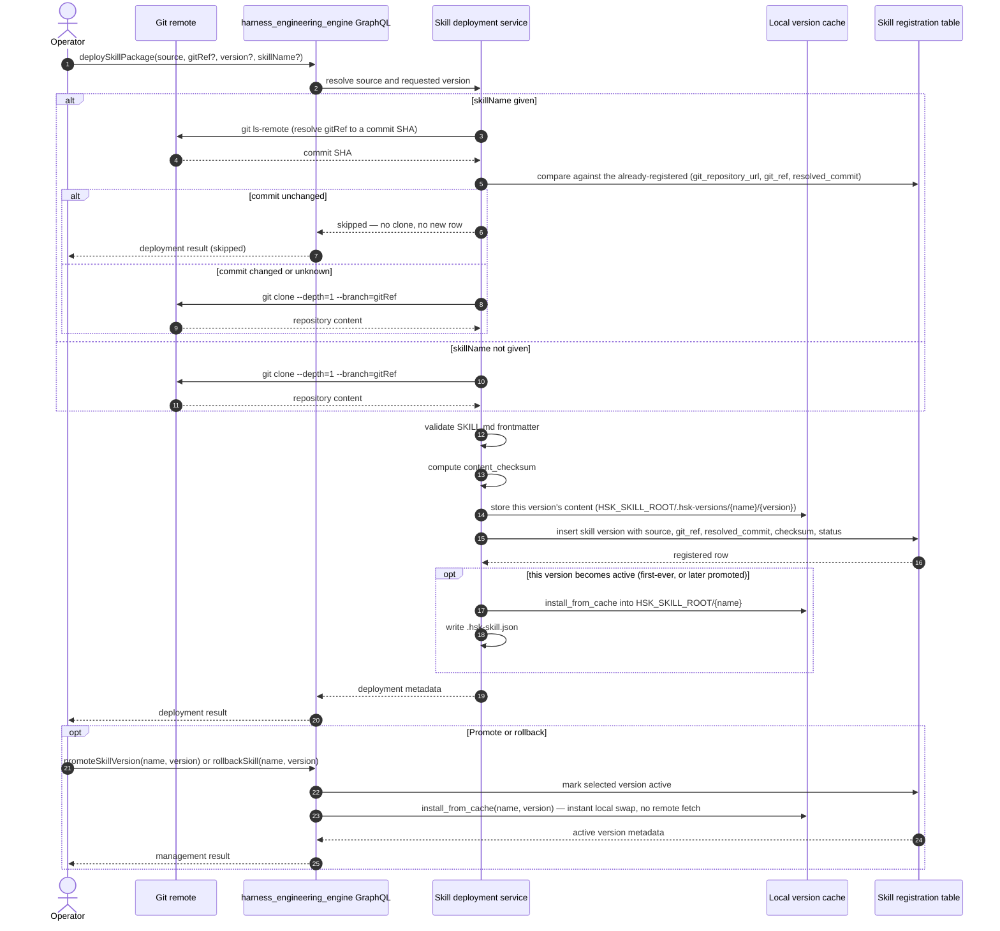
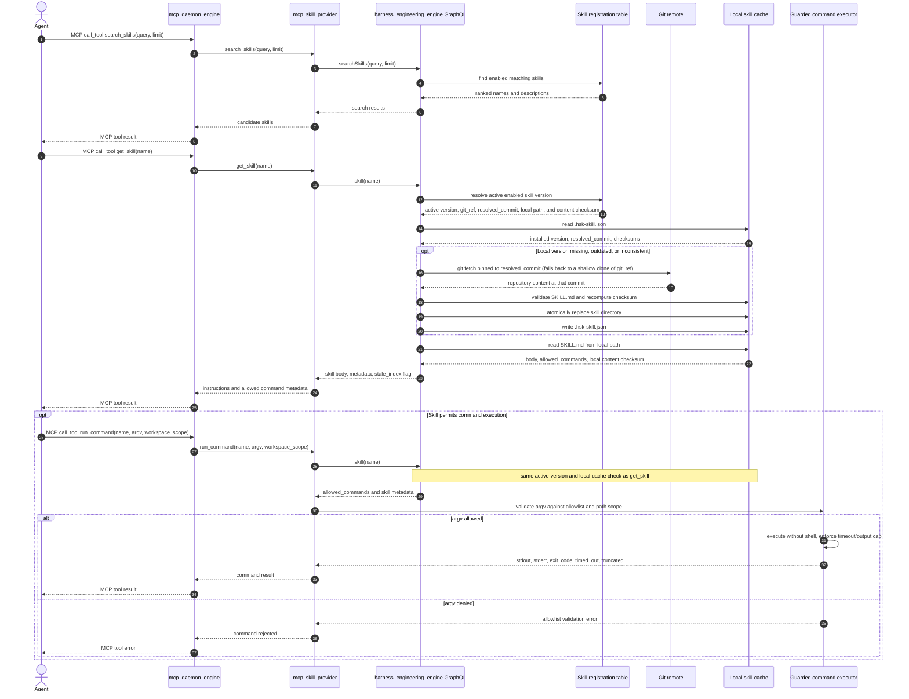
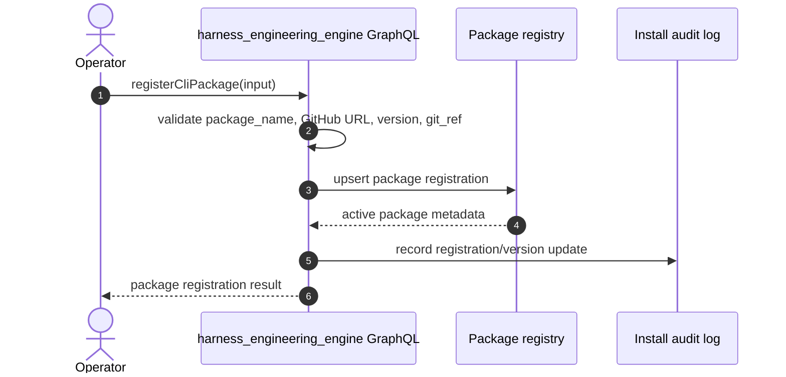
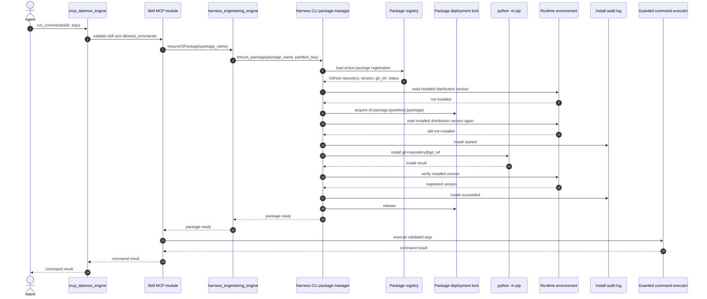

# Harness Engineering - Development Plan

> **Location:** `C:\Users\bibo7\gitrepo\silvaengine\harness_engineering_engine`
> **Date:** 2026-09-06
> **Status:** P1-P6 built and wired end to end; CLI package manager stubbed (v1.1); skill deployment sources directly from git — no S3 or other artifact store; P8 (recursive discovery + CLI package auto-register/install) done; P9 (`reference_files` + OpenAI-assisted section generation) done and verified live against real repos; §18 integration gaps (async `runCommand`/`pollCommand`, non-blocking on-demand refresh, fuzzy `searchSkills`, output-truncation byte counts) resolved

### Implementation status

| Phase | Scope | State |
|---|---|---|
| P1 | Index model, `insertUpdateSkill`, `searchSkills`, `skill(name)` | Done - `skill(name)` now dispatches to on-demand refresh, see Known issue #1 (fixed) |
| P2 | `deploySkillPackage`, git intake, local install, checksums | Done - first version of a skill auto-activates, see Known issue #2 (fixed); S3 eliminated (Known issue #3), ZIP source removed (Known issue #5) |
| P3 | `refreshLocalSkills`, `registerSkills`, rollback/promote/disable/prune | Done |
| P4 | `mcp_skill_provider` module (`search_skills`, `get_skill`), built at `../mcp_skill_provider`, registered with `mcp_daemon_engine` | Done |
| P5 | `run_command` / guarded command executor | Done |
| P6 | Starter skills (`rfq-assistant`, `release-notes`) and templates | Partial - authoring/operator guides not yet written |
| v1.1 | Python CLI package manager (§11) | Stubbed - `CliPackageManager.ensure_package()` raises `NotImplementedError` by design; skills must use local scripts until this ships |
| P8 | Recursive `SKILL.md` discovery; `cli_packages` auto-register + auto-install at deploy time | Done, see Known issue #6 (fixed) |
| P9 | `reference_files`/`references`; OpenAI-assisted generation of missing `allowed_commands`/`cli_packages`/`reference_files`; repo-wide reference-file pull-in; checksum-exclusion bookkeeping | Done, see §5 and §14 P9, and Known issue #7 (fixed) |

Test coverage today (175 `pytest` tests): `checksums` (including `excluded_relpaths` scoping and the two generated sidecars' exclusion), `command_executor` (kill switch, allowlist match/reject, shell-metacharacter rejection, dry run), `async_command_executor` (background launch/poll happy path, unknown `run_id`, partial output while running, timeout kill, output truncation, dry-run, DB-backed cross-instance poll fallback — §18 G-6), `command_run` repository (dual-backend insert/get/update/list/delete against real Postgres, scheduler prune tick — §18 G-6), `config`, `skill_frontmatter` (including `reference_files`), `cli_introspection` (click command-tree walking, installed-console-script reverse lookup), `section_generator` (ambient-tooling denylist, cli_packages discovery, OpenAI call mocked throughout, markdown-fence stripping), `reference_pull` (native vs. pulled-in resolution, traversal rejection), `skill_version_cache` (generated-sections sidecar and checksum-exclusions sidecar round-trip + promote carry-over), `skill_reader` (SKILL.md-declared-vs-sidecar-generated precedence, stale-sidecar/stale-exclusions-by-commit rejection, the P9 `staleIndex` regression — see Known issue #7), `queries.skill::resolve_skill` (name dispatch, not-found handling, uuid fallback, fuzzy-ranked search — §18 G-3), `skill_deployment` (first-version auto-activation, promote-gating, redeploy-skip against real local git repos; recursive `SKILL.md` discovery, `cli_packages` auto-register+install, install-failure isolation, no-cli_packages regression guard, repo-wide reference-file widening/pull-in, docs/tests/README.md exclusion), CLI package manager (registration, install, upgrade, verify, failure handling), integration scenarios against local Postgres (registration, git deploy, on-demand git refresh — now non-blocking, see §18 G-2, promote/rollback, command policy), and resilience/reconciliation (missing data, invalid data, disabled skills, cross-tenant RLS, kill-switch, resolved-commit integrity, single-active-version, content checksum). `tests/test_mcp_integration.py` (13 of the 175, `TestINT001`–`TestINT013`) exercises the full `mcp_skill_provider → harness_engineering_engine` seam end to end — search → get → run, background run → poll, refreshing-status retry, allowlist denial, kill switch, shell-metacharacter rejection, output truncation — via the in-process `dispatch_graphql` entry point (no live gateway process needed). `tests/run_integration.py` runs the same INT-001–012 scenarios standalone with every GraphQL call's query/variables/response captured to a JSON log, for the human-readable report under `docs/test_results/` — it re-runs, rather than adds to, that coverage. Not yet covered: auth/tenant boundaries beyond RLS, and command-executor path-traversal behavior (see §15).

### Known issues (found by tracing the code against this plan, now fixed)

1. **Fixed.** `skill(name)` did not return the skill body and never triggered on-demand refresh (S3-backed at the time this was found; the refresh source has since moved to git — see Known issue #3). `handlers/skill_reader.py` already implemented exactly the logic this plan specifies (§7 "On-demand refresh", §9's return shape, the second mermaid sequence), but nothing in the GraphQL layer called it: `queries/skill.py::resolve_skill` called `get_repo("skill").resolve_single(info, **kwargs)`, a plain DB row fetch, and `types/skill.py::SkillType` had no `body`, `allowed_commands`, `cli_packages`, `local_content_checksum`, or `stale_index` field to carry that data even if it had. A second, independent bug compounded this: the `skill`/`skills` GraphQL fields declared their `name`/`description` arguments as `skill_name=String(name="name", ...)`, which in graphene sets the *GraphQL-facing* argument name but leaves the resolver's Python kwarg as `skill_name` — so `resolve_single`'s `kwargs.get("name")` and `list()`'s `filters.get("name")`/`filters.get("description")` never actually received a value, silently no-oping the name/description filters regardless of the wiring fix. **Applied:** `SkillType` now carries `body`, `allowed_commands`, `cli_packages`, `local_content_checksum`, `stale_index`; `resolve_skill` dispatches `name` lookups to `handlers.skill_reader.skill()` (returning `None` on `ValueError`/`FileNotFoundError`, propagating anything else) and falls back to the repo for `skill_uuid` lookups; `schema.py`'s `skill`/`skills` fields now declare `name`/`description` directly instead of aliasing through `skill_name`/`skill_description`. Covered by `tests/test_queries_skill.py`.
2. **Fixed.** A freshly deployed skill had no active version. `handlers/skill_deployment.py::deploy_skill_package` always inserted with `is_active=False` and `deployment_status="uploaded"`, while every agent-facing read path (`skill_reader._get_active_skill`, `refresh_local_skills`, `run_command`) filters on `is_active=True` - so `deploySkillPackage` alone never made a skill retrievable, even for a brand-new skill with no prior version to roll back from. **Applied:** `deploy_skill_package` now checks for an existing active version of the same skill name before registering; if none exists, the new version is inserted with `is_active=True` and `deployment_status="deployed"`, otherwise it lands inactive as before and still requires an explicit `promoteSkillVersion`. Covered by `tests/test_skill_deployment.py`.
3. **Fixed (architecture change, not a bug).** S3 has been eliminated entirely from skill deployment and retrieval. Skills were, as of this fix, sourced from a git remote (`source_type="git"`) or a local ZIP with no durable remote (`source_type="zip"`); there is no artifact store in between. (ZIP support was subsequently removed too — see Known issue #5.) This invalidates every S3-specific passage written before 2026-09-04 — the rest of this document has been updated to match. `handlers/git_client.py` handles clone/`ls-remote`/SSH-identity concerns; the "is there a new version" check consults git alone (a cheap `git ls-remote`, no clone) via `deploy_skill_package`; `handlers/skill_version_cache.py` provides the local per-version content cache that lets `promoteSkillVersion`/`rollbackSkill` swap versions instantly with no remote fetch. See §2, §6, §7, §9 for current behavior.
4. **Fixed.** `handlers/checksums.py::compute_content_checksum` wrapped `os.walk()` in `sorted()`, which eagerly consumes the whole tree *before* the hidden-directory prune (`dirs[:] = ...`) ever runs — so `.git` directories were silently included in the checksum despite the code's intent to exclude them. This was invisible under the old ZIP-based flow (an extracted ZIP never contains `.git`), but broke the new git-refresh path outright: two different clone methods produce differently-shaped `.git` internals for the identical commit, so the checksum diverged and refresh failed with a false mismatch error. Found via a live smoke test against a real GitHub repo. **Applied:** removed the `sorted()` wrapper — the existing in-place `dirs[:] = sorted(...)` and `sorted(files)` at each level already give deterministic ordering without needing to consume the whole walk upfront. Covered by `tests/test_checksums.py::test_excludes_hidden_directories`.
5. **Fixed (architecture change, not a bug).** ZIP-sourced deployment has been removed entirely. `deploySkillPackage` now only accepts a git remote — the `sourceType` GraphQL argument and the `source_type` parameter on `deploy_skill_package()` are gone, since there is only one supported value. The local per-version cache (`handlers/skill_version_cache.py`) is retained: it still makes `promoteSkillVersion`/`rollbackSkill` instant (no remote fetch on every promotion), and every host that never cached a given version falls back to fetching it straight from git, pinned to the registered commit. `source_type`/`git_repository_url` columns are kept on the registration row (always `"git"` going forward) rather than removed, to avoid a second schema churn in the same week. Covered by `tests/test_skill_deployment.py`, `tests/test_integration.py`, `tests/test_resilience.py` (all rewritten to deploy from real local git repos).

6. **Fixed.** `deploySkillPackage` could not fully onboard a skill that (a) nested `SKILL.md` more than one directory deep in its repo, and/or (b) declared a `cli_packages` dependency that had never been separately registered or installed. Raised while evaluating a real external repo shaped this way (`multilingual_slide_video_production_system`). Discovery was `content_root.glob("*/SKILL.md")` plus a root-level fallback — no recursive search, so a `SKILL.md` nested under a further subfolder (e.g. `src/skills/<name>/SKILL.md`) failed with "No SKILL.md found." Separately, a skill's `cli_packages` frontmatter was purely declarative: it was read only at `runCommand` time, and `ensure_package()` required the package to already exist via a prior `insertUpdateCliPackage` call — no path registered or installed a declared `cli_packages` entry automatically. **Applied:** discovery is now recursive (`content_root.rglob("SKILL.md")`, pruning `.git`, `handlers/skill_deployment.py:164-170`); a new `_ensure_cli_packages()` helper runs per discovered skill, right before that skill's DB row is written — it auto-registers (`register_cli_package`) any `cli_packages` entry that carries `git_repository_url`+`version` (entries without those are assumed pre-registered), then always calls `ensure_package()` to install/verify immediately at deploy time (decided 2026-09-04 in favor of installing right away rather than deferring to first `runCommand`, accepting that deploy now depends on network/pip and may install on a host that never ends up running that skill). A failed install raises, landing that skill in `failed` rather than registering a skill whose declared dependency doesn't actually work — the skill row is never written in that case. `runCommand`'s existing `ensure_package()` call is unchanged and acts as a cheap safety-net re-check. Covered by `tests/test_skill_deployment.py::TestDeploySkillPackageDiscoveryAndCliPackages` (nested discovery, auto-register+install success, install-failure isolation, and a no-op regression guard for skills with no `cli_packages`).
7. **Fixed.** A skill deployed cleanly with P9's repo-wide reference-file pull-in (§5) came back from `skill(name)` with `stale_index: true` even immediately after deploy — and, with `HSK_ALLOW_UNREGISTERED_CHANGES` at its documented default of `false`, would have made `skill()` raise on *every* read instead. Root cause: `deploySkillPackage` registers `content_checksum` computed with pulled-in `reference_files` entries excluded (they're a copy of material the skill doesn't itself author, living elsewhere in the same repo — see §5), but `skill_reader.skill()`'s own read-time checksum recomputation recomputed over the full installed directory with no such exclusion, so the two could never match for any skill that had pulled in even one file. Found live, from the actual GraphQL response, while inspecting `skill(name)` output for a real deployed skill. **Applied:** the excluded-path set is now recorded at deploy time in its own local sidecar (`.hsk-checksum-exclusions.json`, itself checksum-exempt and carried across `promoteSkillVersion`/`rollbackSkill` the same way the generated-sections sidecar already is — see §5) and re-read by `skill()` before it recomputes the local checksum, so the same paths are excluded on both sides of the comparison. Deliberately kept out of `.hsk-generated.json`: that file is what an author or agent inspects to see "what got generated for this skill"; the exclusion list is pure internal bookkeeping nobody needs to read. Covered by `tests/test_skill_reader.py::test_pulled_reference_file_does_not_falsely_flag_stale_index` and `test_checksum_exclusions_from_a_different_commit_are_ignored`, `tests/test_skill_version_cache.py::TestChecksumExclusions`, `tests/test_skill_deployment.py::test_pulled_reference_files_recorded_in_checksum_exclusions_sidecar`.

---

## 0. Executive summary

This project is feasible as a controlled internal v1.

The simplified design avoids the expensive parts of the full runtime: no skill stack, no dynamic tool hot-swapping, no lifecycle table, no server-side context budgeting, and no per-provider handler changes. Instead, operators deploy skills directly from a git remote or a ZIP package — there is no S3 or other artifact store in between. The registration table records each skill's name, version, source reference, resolved git commit, checksums, deployment status, and searchable metadata. Every deployed version's content is cached locally, and the active version is installed under `HSK_SKILL_ROOT` for use as the runtime cache. A skill MCP module is registered with `mcp_daemon_engine` so an agent can call `search_skills`, `get_skill`, and `run_command` through the existing MCP runtime.

The main feasibility risk is not the GraphQL or database work. The main risks are operational and security related:

- The engine must be able to refresh local skill folders straight from git when they are missing or stale.
- `run_command` must be tightly constrained.
- Tenant/auth boundaries must be explicit.
- Search quality must be scoped to a simple v1.

With those constraints made explicit, the project is a reasonable 3-4 week build for a team already familiar with SilvaEngine conventions, git-based deployment, and `mcp_daemon_engine`. Add roughly one extra week if auth, deployment, or command-executor isolation patterns need to be created from scratch.

---

## 1. Target outcome

Give agents skills on demand without embedding a full runtime into the agent core.

The v1 system should let an agent:

1. Search a lightweight skill catalog.
2. Retrieve the full instructions for one selected skill.
3. Follow the skill's steps using already-available MCP tools.
4. Run a tightly allowlisted CLI command only when the skill explicitly permits it.
5. Validate and install an approved Python CLI package from GitHub when a skill depends on one.

The system should let operators:

1. Author skills as folders in source control.
2. Deploy skills directly from a git remote — no S3, ZIP upload, or other artifact store in between.
3. Register, refresh, roll back, disable, or prune skills without exposing the whole catalog to every agent.

---

## 2. Architecture

The system has three layers.

```text
harness_engineering_engine
  skills/ folder
    - SKILL.md and helper files are the local runtime cache
    - body, allowed_commands, templates, and scripts stay on disk

  database
    - stores registration, deployment, and searchable metadata
    - name, version, description, source, git_ref, resolved_commit, checksum, deployment status, enabled

  GraphQL
    - deploySkillPackage
    - refreshLocalSkills
    - rollbackSkill
    - promoteSkillVersion
    - disableSkill
    - pruneSkillVersions
    - registerSkills
    - insertUpdateSkill
    - skills
    - searchSkills
    - skill

mcp_daemon_engine
  - existing gateway-dispatched MCP runtime
  - loads the `mcp_skill_provider` MCP module
  - exposes search_skills, get_skill, run_command as MCP tools
  - records tool calls through existing MCPFunctionCall flow

agent
  - invokes mcp_daemon_engine MCP endpoint
  - calls search_skills and get_skill
  - follows the instructions
  - calls other MCP tools or run_command as needed
```

Git (for `source_type="git"`) plus the registration table are the deployment source of truth; there is no S3 or other artifact store. A local per-version cache (`handlers/skill_version_cache.py`) holds every deployed version's content on the deploying host, and the active version's content is additionally installed under `HSK_SKILL_ROOT`. The database stores metadata and searchable fields, not full skill content. The local file system is the runtime cache used by `skill(name)` and `run_command`.

### Skill deployment sequence



### Skill request load and refresh sequence



---

## 3. Configuration

Do not hardcode the skill folder or command execution behavior. The engine and skill MCP module should load a small explicit configuration at startup.

| Setting | Required | Purpose |
|---|---:|---|
| `HSK_SKILL_ROOT` | Yes | Absolute or app-relative folder containing skill directories. This is the default root for registration and skill file reads. |
| `HSK_GIT_SSH_KEY_PATH` | No | Alternate SSH private key for git-over-SSH skill sources. Empty means "use the system default identity" (ssh-agent / `~/.ssh/config`); HTTPS remotes use whatever git credential helper is already configured and ignore this setting. |
| `HSK_SKILL_LOCAL_METADATA_FILE` | No | Metadata filename stored in each local skill directory. Default `.hsk-skill.json`. |
| `HSK_SKILL_REFRESH_ON_STARTUP` | No | Whether startup compares local metadata with the registration table and, for git-sourced skills, refreshes from the git remote. |
| `HSK_ALLOW_UNREGISTERED_CHANGES` | No | Allows `skill(name)` to return a body when the local content checksum differs from the registered content checksum. Default `false` outside local development. |
| `HSK_RUN_COMMAND_ENABLED` | No | Global kill switch for guarded command execution. Default `false` until the executor is deployed and audited. |
| `HSK_RUN_COMMAND_DEFAULT_TIMEOUT_SECONDS` | No | Default timeout when an `allowed_commands` entry does not specify one. |
| `HSK_RUN_COMMAND_OUTPUT_LIMIT_BYTES` | No | Default stdout/stderr cap when an `allowed_commands` entry does not specify one. |
| `HSK_RUN_COMMAND_WORKSPACE_ROOT` | No | Optional workspace root used when `workspace_scope` is `workspace_dir`. |
| `HSK_DRY_RUN` | No | Resolve and validate `run_command` without executing it. Useful for tests and deployment checks. |
| `OPENAI_API_KEY` | No | P9 section generation (§5). Shared, non-`HSK_`-prefixed setting — other engines in this gateway use the same key for their own OpenAI calls. Empty disables generation entirely; deploys still succeed, the fields simply stay absent. |
| `OPENAI_BASE_URL` | No | P9 section generation. Same shared setting as above; empty means the OpenAI SDK's own default (`api.openai.com`). |
| `HSK_OPENAI_MODEL` | No | P9 section generation. Harness-specific, unlike the two settings above. Default `gpt-4o-mini`. |

Configuration should be server-side and tenant-aware where needed. Agent-facing MCP tools must not accept arbitrary filesystem roots, environment variables, or execution policy overrides.

`registerSkills(root, prune)` may accept a `root` argument for admin workflows, but the resolver must normalize it and reject paths outside configured skill roots. The normal deploy path should use `HSK_SKILL_ROOT` directly after local skills have been refreshed from git.

---

## 4. What changes from the full plan

| Area | Full runtime plan | Simplified v1 |
|---|---|---|
| Skill source | Uploaded package / runtime-managed skill | Git remote only, sourced directly — no artifact store, no ZIP upload |
| Skill storage | DB may hold full body and runtime metadata | Git remote is the durable record for git-sourced skills; DB stores registration index; local disk stores a per-version cache plus the runtime cache |
| Retrieval | Runtime catalog plus skill stack | GraphQL search and get |
| Agent integration | Handler changes and enabled-tool updates | Skill MCP module in `mcp_daemon_engine` |
| Tool control | Per-skill tool hot-swap | Fixed tools; skill text names which tools to use |
| State tracking | `skill_tasks`, steps, completion state | Conversation state only |
| Context control | Server-managed budget/lifecycle | Agent chooses what to retrieve |
| CLI execution | Managed as part of runtime | One guarded `run_command` tool behind `mcp_daemon_engine` |
| Estimated build | 8-10 weeks | 3-4 weeks, assuming existing patterns |

Use the simplified plan when skills are runnable playbooks. Use the full plan only when the platform needs server-enforced orchestration, automatic tool narrowing, step lifecycle tracking, or context-budget management.

---

## 5. Skill format

Each skill is a directory under the configured `HSK_SKILL_ROOT`. Each directory must contain a `SKILL.md`.

```text
harness_engineering_engine/
  skills/
    rfq-assistant/
      SKILL.md
      intake_questionnaire.md
      scripts/
        build_quote.py
    invoice-reconcile/
      SKILL.md
    release-notes/
      SKILL.md
      template.md
```

`SKILL.md` uses YAML frontmatter plus a markdown instruction body.

```markdown
---
name: rfq-assistant
description: >
  RFQ collection and quotation workflow. Use when the user needs a price quote
  for one or more products, especially with multi-supplier negotiation.
allowed_commands:
  - argv: ["python", "scripts/build_quote.py", "--spec", "*.json"]
---

You are an RFQ assistant. Work through the steps below.

## Steps

1. Collect product specifications using `intake_questionnaire.md`.
2. Search the supplier catalog with `rfq.search_product(name)`.
3. Build the quote with `run_command`.
4. File the quote with `rfq.create_quote(...)`.
5. Present the quote and ask the user to accept, reject, or negotiate.

## Conventions

- Always confirm units of measure and currency.
- Prefer an MCP tool when one exists.
- Use `run_command` only for approved command-line tools.
```

Required frontmatter fields:

| Field | Required | Purpose |
|---|---:|---|
| `name` | Yes | Stable public skill identifier. Unique per tenant/partition. |
| `description` | Yes | Searchable summary and usage guidance. |
| `allowed_commands` | No | Structured argv allowlist for `run_command`. If omitted, the skill is read-only (deny-by-default — see Known issue #6). |
| `cli_packages` | No | External Python CLI dependencies. An entry with `git_repository_url`+`version` is auto-registered and installed at deploy time (P8); one without them is assumed pre-registered via `insertUpdateCliPackage`. |
| `reference_files` | No | Explicit list of paths, relative to the skill directory, whose content should be returned alongside `body` in `skill(name)`. For prose/config the agent needs to read — never for scripts (those stay execution-only, referenced by path inside `allowed_commands`). May name a path that isn't physically in the skill's own folder yet; see "Repo-wide reference files" below. |

Recommendation: use structured `allowed_commands` entries rather than shell-like strings. This avoids ambiguity around quoting, redirection, pipes, and path traversal.

### Reference files and auto-generated sections (P9 — done)

`reference_files` is additive and orthogonal to `allowed_commands`/`cli_packages` — a path can appear on it, on `allowed_commands`, on both, or neither. `skill(name)` reads every listed file (containment-checked against the installed skill directory, same rule as everywhere else path input is trusted) and returns `{"path": ..., "content": ...}` per entry in a `references` field, alongside the existing `body`/`allowedCommands`/`cliPackages`. `SKILL.md` itself is never returned as a reference, even if an author explicitly lists it — its content is already in `body`.

#### Auto-generation, only when a field is genuinely absent

When a skill's `SKILL.md` leaves `allowed_commands`, `cli_packages`, and/or `reference_files` out of its frontmatter entirely, `deploySkillPackage` proposes values for whichever of those fields are missing. **A field the author already populated — even as an explicit empty list — is never touched or overridden; generation only fills a key that's genuinely absent from the raw YAML.** This is a materially different design from the `allowed_commands_override`/`cli_packages_override` DB-column approach explored and reverted earlier in this document: there is no database column here at all, and no `suggestAllowedCommands`-style tool exposed to callers either (also explored and reverted) — generation happens once, automatically, at deploy time.

Two independent mechanisms, matched to two different risk profiles:

- **`cli_packages` discovery is deterministic and LLM-free.** `handlers/section_generator.py` scans the skill's body text for backtick-quoted command tokens (`` `msv pipeline status` `` → candidate `msv`) and checks each against every *actually installed* console-script on the deploying host (`handlers/cli_introspection.py::find_installed_packages_for_commands`, via `importlib.metadata`). A candidate that isn't installed is simply dropped — nothing is invented, no `git_repository_url` is guessed, and no package is installed as a side effect of discovery. An **ambient-tooling denylist** (`pip`, `python`, `git`, `npm`, `docker`, and similar) is checked before that lookup ever runs, since these are near-universal dev tools that show up in setup asides ("installed via `` `pip install -e .` ``") rather than a skill's own domain dependency — without it, a skill mentioning `pip` in a setup note would get `pip` itself registered as a `cli_packages` entry.
- **`allowed_commands`/`reference_files` are OpenAI-backed, but grounded in real, locally-observable state — never trusted blind.** The model is given the skill's own body text, the *real* introspected command tree (`click`'s `Group.commands`, walked recursively) of every declared-or-discovered `cli_packages` entry, and the actual list of candidate files on disk (see "Repo-wide reference files" below) — never an invented argv or path. Every proposed value is re-validated against that same real data after the call returns, before it's trusted: an `allowed_commands` entry must resolve to a real command in the introspected tree; a `reference_files` entry must be in the candidate file list. `allowed_commands` is a strict allowlist — the prompt instructs the model to exclude any subcommand the body text treats as gated behind human approval (an "approve"/"publish"/"release"-style action), even though the command is real and installed.

#### Repo-wide reference files

A monorepo often keeps shared reference material — config, and even a CLI dependency's own source — at the repository root rather than duplicated into every skill's own folder (the real-world case this was built against: `multilingual_slide_video_production_system`, where every skill's own directory contains nothing but `SKILL.md`, and the actual config/source it needs lives at the repo root). `skill(name)`'s read path only ever looks inside the installed skill directory, by design, so `deploySkillPackage` bridges that gap at deploy time:

- **Candidate widening.** When `reference_files` is absent, `handlers/skill_deployment.py::_list_repo_wide_files` widens the generation candidate pool beyond the skill's own folder to the *whole* cloned repository — excluding every other discovered skill's own directory (so one skill's generation is never handed another skill's internal files), `SKILL.md`/`README.md` anywhere, and anything under a `docs` or `tests` folder (none of that is reference material a skill needs a copy of).
- **Pulling the chosen files in.** Whichever `reference_files` a skill ends up with — declared or generated — that name a path outside the skill's own directory get physically copied in from wherever else in the same repo clone they live (`handlers/reference_pull.py::pull_reference_files`, containment-checked against both the skill directory and the repo root) before the skill is checksummed. This is why `skill(name)`'s read path never needs any knowledge of the wider repo layout — by the time it runs, the files are just sitting in the installed skill directory like any other content.
- **Checksum consistency.** A pulled-in file is a copy of material the skill doesn't itself author, so it's excluded from `content_checksum` — but only the pulled-in subset, by exact relative path (`compute_content_checksum`'s `excluded_relpaths` argument), never by basename; a *native* reference file with the same name deliberately authored inside the skill's own folder must still count toward the checksum. `handlers/skill_refresh.py::refresh_single_skill` mirrors the same pull-in step for a skill's *declared* `reference_files` when a different host refreshes straight from git, so the checksum it recomputes matches what was originally registered. (Generated-only `reference_files` aren't reproducible from a plain refresh on a different host — same boundary the generated-sections sidecar already has, see below.)

#### Where generated values are stored, and why there are two sidecar files

Generated `allowed_commands`/`cli_packages`/`reference_files` are written to a local sidecar file next to the installed `SKILL.md`, `.hsk-generated.json` — the file an author or agent would actually inspect to see "what got generated for this skill." A second, separate sidecar, `.hsk-checksum-exclusions.json`, records which specific `reference_files` paths were pulled in from elsewhere (see above) — pure internal bookkeeping `skill()`'s own read-time checksum recomputation needs, nothing a human needs to see, so it's kept out of the human-facing file entirely.

Both sidecars are *excluded from `content_checksum`* the same way `.hsk-skill.json` already is (`compute_content_checksum`'s `metadata_filename` argument excludes one file by basename; `GENERATED_SIDECAR_FILENAME` and `CHECKSUM_EXCLUSIONS_FILENAME` add two more). This is the load-bearing design choice behind the whole feature: `skill_refresh.py` always re-derives local content from git and compares against the checksum registered at deploy time, so if either sidecar's own content were folded into checksum-covered content, every future on-demand refresh would look permanently stale. Both sidecars are dotfiles living in the local per-version cache (`HSK_SKILL_ROOT/.hsk-versions/<name>/<version>/`), and both are carried across explicitly by `install_from_cache` when a version is promoted — the same copytree that installs a cached version's content already ignores dotfiles (to correctly drop `.git`), so each sidecar needs its own explicit `shutil.copy2` alongside that copy, exactly like `.hsk-skill.json` already gets its own separate write.

**Failure mode.** An OpenAI call failure/timeout/malformed response during deploy does not fail the skill's deploy — the missing field(s) simply stay absent, preserving `allowed_commands`' deny-by-default guarantee (no partial/malformed allowlist is ever written from a failed generation). `cli_packages` discovery has no such failure mode at all — it's local and synchronous, no network call involved.

**Regeneration frequency — every deployment.** For a skill that leaves any of these three fields absent, every `deploySkillPackage` call regenerates both sidecars from scratch (not just the first, not conditional on either sidecar already existing) — so they always reflect the CLI package's *current* command surface and the repo's *current* file layout as of that deploy, at the cost of an OpenAI call (and possible small variance) on every such deploy. The redeploy-skip path (unchanged commit, `skillName` given) still short-circuits before cloning at all, so an unchanged skill never re-triggers this.

---

## 6. Database model

The v1 database has one new model: `Skill`.

The database stores registration and deployment metadata only. It does not store the full skill body, helper files, templates, or scripts. For a git-sourced skill, the git remote itself is the durable record of content; there is no S3 or other artifact store. A local per-version cache (§7) holds each deployed version's content on the deploying host, and the local skill directory under `HSK_SKILL_ROOT` is the runtime cache.

| Column | Purpose |
|---|---|
| `partition_key` | Tenant/partition isolation, following SilvaEngine conventions. |
| `skill_uuid` | Stable row id within the partition. Composite primary key with `partition_key`. |
| `endpoint_id`, `part_id` | SilvaEngine gateway tenant metadata carried alongside `partition_key`. |
| `name` | Public identifier, unique per partition. |
| `version` | Version identifier for the deployed skill package. |
| `description` | Searchable description. |
| `source_type` | Always `git`. |
| `git_repository_url` | Git remote URL. |
| `git_ref` | The branch or tag requested at deploy time (`git` only). |
| `resolved_commit` | The commit SHA `git_ref` resolved to at deploy time (`git` only) — this, not `git_ref` alone, is what refresh pins to and what the cheap redeploy-skip check compares. |
| `content_checksum` | Hash of the unpacked skill folder content. |
| `local_path` | Runtime cache path under `HSK_SKILL_ROOT`. Populated by `registerSkills`, not by `deploySkillPackage`. |
| `deployment_status` | `uploaded`, `registered`, `deployed`, `failed`, `disabled`, or `rolled_back`. |
| `enabled` | Soft enable/disable flag, set by `disableSkill`/`pruneSkillVersions`. |
| `is_active` | Whether this version is the one served to agents. `deploySkillPackage` sets `is_active=true` for a skill's first-ever version and `false` for later versions of an already-active skill; `promoteSkillVersion`/`rollbackSkill` set it explicitly otherwise. Exactly one version per skill should be active at a time. |
| `registered_at` | When this version was registered. |
| `created_at`, `updated_by`, `updated_at` | Bookkeeping. `updated_by` is a required argument on every management mutation. |

### Feasibility constraint

For v1, choose one of these local runtime cache assumptions and document it explicitly:

| Option | Feasibility | Notes |
|---|---|---|
| Single engine host | Lowest risk | Startup refresh clones git-sourced skills into local `HSK_SKILL_ROOT`. |
| Shared mounted volume | Feasible | All engine instances can share the refreshed runtime cache. |
| Per-instance local cache | Feasible | Every instance must run startup or scheduled refresh and validate local metadata; a skill refreshes straight from its git remote, pinned to the registered commit. |

If the engine runs on multiple instances without shared storage, raw local paths are not a deployment source of truth. Treat git (for `git`-sourced skills) plus the registration table as authoritative, and treat local directories — including the per-version cache — as disposable caches.

---

## 7. Skill deployment and management

Deployed skills should be versioned. Operators provide a git remote (a repository URL, optionally over SSH) — there is no artifact store, and no ZIP upload path, in between.

### Deploy skills

```text
deploySkillPackage(source, gitRef?, version?, skill_name?)
  -> accept a git remote URL
  -> if skill_name is known, cheaply resolve gitRef to a commit SHA via
     `git ls-remote` (no clone) and skip the deploy entirely if that commit is
     already registered for this skill's (git_repository_url, git_ref) — git alone
     decides whether a new version exists
  -> otherwise, shallow-clone the repository at gitRef
  -> validate that each skill has SKILL.md with required frontmatter
  -> compute content_checksum
  -> cache this version's content locally, keyed by (skill_name, version)
  -> register each skill version in the Skill table with source, git_ref,
     resolved_commit, checksum, status
  -> if this version becomes active, install its cached content into
     HSK_SKILL_ROOT and write .hsk-skill.json
  -> mark deployment_status as deployed or registered
```

`deploySkillPackage` auto-activates a skill's first-ever version (`is_active=true`, `deployment_status="deployed"`), so a brand-new skill is retrievable immediately after deploy. Every version after that still lands inactive (`is_active=false`, `deployment_status="registered"`) and requires an explicit `promoteSkillVersion` before `skill(name)`, `run_command`, or `refreshLocalSkills` will see it (see Known issue #2 above, fixed) — but its content is still cached locally the moment it's deployed, so promoting it later is an instant local swap, not a fresh fetch.

SSH remotes (`git@host:org/repo.git` or `ssh://...`) use the system's default SSH identity (ssh-agent / `~/.ssh/config`); set `HSK_GIT_SSH_KEY_PATH` only when a skill source needs a different key than the host's default. HTTPS remotes use whatever git credential helper is already configured on the host.

`SKILL.md` discovery is recursive — a repo can nest a skill any number of directories deep (e.g. a monorepo shaped like `src/skills/<name>/SKILL.md`), not just directly under the repo root. A skill declaring `cli_packages` in its frontmatter has each entry auto-registered (when it carries `git_repository_url`+`version`) and installed/verified immediately as part of this same deploy, rather than waiting for the first `run_command` — an install failure fails only that skill's entry in `failed`, without registering it (see Known issue #6).

### Local metadata

Each installed skill directory should include local metadata, defaulting to `.hsk-skill.json`.

```json
{
  "name": "rfq-assistant",
  "version": "2026.08.24.1",
  "source_type": "git",
  "git_repository_url": "https://github.com/example/skills.git",
  "git_ref": "main",
  "resolved_commit": "5c01ea17e962f30ecf5f2c4014d12781abf35e99",
  "content_checksum": "def456",
  "last_refresh_at": "2026-08-24T12:00:00Z"
}
```

This file is not authoritative. It is a fast local comparison point used during startup, explicit refresh, and on-demand skill retrieval.

### Startup and refresh

```text
refreshLocalSkills()
  -> query enabled registered skill versions
  -> read local .hsk-skill.json files under HSK_SKILL_ROOT
  -> compare name, version, content checksum, and resolved_commit
  -> for a stale/missing skill, fetch the git remote pinned to resolved_commit
     (falls back to a shallow clone of git_ref)
  -> unpack into a temporary directory
  -> validate SKILL.md and recompute content checksum
  -> atomically replace the local skill directory
  -> write .hsk-skill.json
  -> mark deployment_status as deployed or failed
```

Refresh should be safe to run repeatedly. Failed refreshes must not leave a partial skill directory active; keep the previous valid version until the new version is fully unpacked and validated.

### On-demand refresh

`skill(name)` must verify that the local runtime cache matches the active registered version before it returns `SKILL.md`.

```text
skill(name)
  -> resolve the active enabled registration row
  -> read local .hsk-skill.json from the expected skill directory
  -> compare name, version, content checksum, and resolved_commit
  -> if local metadata is missing, outdated, or inconsistent, fetch the active
     version from git, pinned to resolved_commit
  -> unpack and validate into a temporary directory
  -> atomically replace the local skill directory
  -> write .hsk-skill.json
  -> read SKILL.md and return the skill body
```

This makes rollback a management-state change. `promoteSkillVersion`/`rollbackSkill` swap the local skill directory immediately from the local version cache (no remote fetch); the next `skill(name)` or `run_command(name, ...)` request is a fallback for a host that never cached that version, and refreshes from git if the local directory is not current.

### Rollback

Rollback should only select a previous registered version as the active version for the skill. It should not directly mutate local skill directories beyond swapping in that version's cached content. Do not mutate or overwrite git history.

```text
rollbackSkill(name, version)
  -> verify the requested version exists and is enabled
  -> mark the requested version as active
  -> mark the previous active version as inactive or superseded
  -> set deployment_status to rolled_back for management visibility
  -> swap the local skill directory to the requested version's cached content
  -> return the selected active version metadata
```

### Management operations

Management operations should act on registration rows and never require agents to list the full catalog.

| Operation | Purpose |
|---|---|
| `skills(enabled?, name?)` | Admin catalog view across registered versions and deployment statuses. |
| `disableSkill(name, version?)` | Disable a specific version or the whole skill so it no longer appears in `searchSkills`. |
| `promoteSkillVersion(name, version)` | Mark a registered version as the active version. Local disk updates on the next `skill(name)`, `run_command`, or explicit refresh. |
| `pruneSkillVersions(name, keep)` | Disable old registration rows and reclaim their local version cache; git history remains the durable record, so a pruned version stays recoverable via a redeploy. |

---

## 8. Registration

`registerSkills` is a GraphQL mutation or engine job. It scans `HSK_SKILL_ROOT` by default, reads frontmatter and local metadata, validates the skill, computes a content checksum, and upserts the searchable index fields for the installed version.

```text
registerSkills(root, prune)
  -> resolve root against configured skill roots
  -> reject root if outside the configured allowlist
  -> scan root for */SKILL.md
  -> read local .hsk-skill.json when present
  -> parse YAML frontmatter
  -> validate name, description, allowed_commands
  -> compute content_checksum
  -> insertUpdateSkill(name, version, description, local_path, source, checksums, deployment_status, enabled)
  -> optionally disable rows whose folders no longer exist
```

Registration should be idempotent. If the checksum has not changed, the job can skip the row.

### Important drift rule

The plan intentionally allows live file reads, so body edits can take effect without re-registration. That is convenient, but it creates possible drift between the DB index and disk.

Mitigation for v1:

- `skill(name)` should return the current local content checksum with the body.
- If the local content checksum differs from the registered `content_checksum`, include a `stale_index: true` flag.
- In strict environments, reject stale reads unless an operator has enabled `allow_unregistered_changes`.

This keeps local development fast while giving production a clear safety switch.

---

## 9. GraphQL surface

The engine owns the GraphQL contract.

| Operation | Type | Consumer | Purpose |
|---|---|---|---|
| `deploySkillPackage(source, version, skillName?)` | Mutation/job | Admin, CI, deploy hook | Accept a git remote, install it directly (no artifact store), and create registration rows. |
| `refreshLocalSkills()` | Mutation/job | Admin, startup, deploy hook | Proactively compare local metadata to the registration table and refresh git-sourced local skill directories. |
| `rollbackSkill(name, version)` | Mutation/job | Admin/operator only | Select a previous registered version as active. Swaps local disk from the version cache immediately. |
| `promoteSkillVersion(name, version)` | Mutation/job | Admin/operator only | Mark a registered version as the active version. Swaps local disk from the version cache immediately. |
| `disableSkill(name, version?)` | Mutation | Admin/operator only | Disable a skill or skill version from search/retrieval. |
| `pruneSkillVersions(name, keep)` | Mutation/job | Admin/operator only | Disable old rows and reclaim their local version cache. |
| `registerSkills(root, prune)` | Mutation/job | Admin, CI, deploy hook | Scan installed folders and refresh searchable index fields. |
| `insertUpdateSkill(input)` | Mutation | Admin/job | Upsert one index row. |
| `skills(enabled)` | Query | Management only | Show the full catalog. Not exposed as an agent MCP tool. |
| `searchSkills(query, limit)` | Query | Agent through MCP | Return ranked `name` and `description` matches. |
| `skill(name)` | Query | Agent through MCP | Resolve the active version, refresh local cache from git if needed, read `SKILL.md`, and return body, metadata, and allowlist. |

`skill(name)` returns:

```text
name
version
description
body
allowed_commands
cli_packages
references
local_path
git_repository_url
git_ref
resolved_commit
content_checksum
local_content_checksum
stale_index
deployment_status
updated_at
```

`allowed_commands`/`cli_packages`/`reference_files` are each SKILL.md's own declared value if the author wrote it, otherwise whatever P9 generated for that field (§5) — never a mix of the two for the same field. `references` is the resolved `{"path": ..., "content": ...}` list for whatever `reference_files` value that resolves to.

### Search scope

Use lexical search for v1:

- Match on `name` and `description`.
- Return a small default limit, for example 5 or 10.
- Rank exact name matches first, then prefix/name matches, then description matches.

Embeddings can be added later if the catalog grows large enough to justify them.

---

## 10. MCP daemon integration

Use the existing `mcp_daemon_engine` runtime as the agent-facing integration point. The sibling package already exposes gateway dispatch functions such as `dispatch_mcp`, `dispatch_graphql`, and `dispatch_mcp_async`; the skill tools should be delivered as an MCP module loaded into that runtime, not as a separate processor service.

The skill MCP module (`mcp_skill_provider`) holds no skill data of its own. It invokes the `harness_engineering_engine` GraphQL surface for discovery and retrieval, then delegates command execution to a small guarded command executor only for `run_command`.

| MCP tool | Implementation | Returns |
|---|---|---|
| `search_skills(query, limit?)` | MCP tool in `mcp_skill_provider`. Calls Harness `searchSkills`. | Ranked skill names and descriptions. |
| `get_skill(name)` | MCP tool in `mcp_skill_provider`. Calls Harness `skill(name)`. | Plain-text instructions and metadata. |
| `run_command(name, argv, workspace_scope?)` | MCP tool in `mcp_skill_provider`. Calls Harness `skill(name)` for allowlist, then uses the guarded command executor. | `stdout`, `stderr`, `exit_code`, `timed_out`, `truncated`. |

Do not expose `list_skills` as an agent tool in v1. A full catalog dump is a management function and can waste context.

### MCP module registration

Register `mcp_skill_provider` through `mcp_daemon_engine` using its existing module/function metadata flow. The expected deployment path is:

```text
loadMcpConfiguration
  -> registers the module as mcp_skill_provider
  -> registers tools: search_skills, get_skill, run_command
  -> mcp_daemon_engine lists and calls those tools through its MCP endpoint
```

The agent should call `mcp_daemon_engine` using the normal MCP JSON-RPC path. Tenant identity should come from the gateway-provided `endpoint_id`, `part_id`, `partition_key`, and `context.user`, matching the existing daemon pattern.

#### Package layout

`mcp_skill_provider` is a standalone Python package, not part of `harness_engineering_engine`. It is built at `../mcp_skill_provider` (a sibling repo alongside `mcp_daemon_engine` under `silvaengine`):

```
mcp_skill_provider/
  __init__.py
  mcp_skill_provider.py       # MCPSkillProvider entry point, composes the mixins below
  skill_mixin.py               # search_skills, get_skill
  command_mixin.py             # run_command
  graphql_backed_processor.py  # Shared base: dispatches through harness_engineering_engine GraphQL
  graphql_client.py            # Internal GraphQL calls to harness_engineering_engine
  error_handler.py             # MCP-facing error normalization
  mcp_configuration.py         # loadMcpConfiguration manifest
```

`skill_mixin.py` and `command_mixin.py` expose the three MCP tools as methods on `MCPSkillProvider`, each built on `GraphQLBackedProcessor` so they inherit a common dispatch path to `harness_engineering_engine`. The module is registered with `mcp_daemon_engine` via the standard `loadMcpConfiguration` flow described above.

---

## 11. Command execution security

`run_command` is the sharp edge of the system. Treat the subprocess portion as a separate security-sensitive component called the guarded command executor.

The guarded command executor is not an agent-facing service. It is a small internal helper used only by the skill MCP module after `run_command(name, argv, workspace_scope?)` has fetched the named skill and confirmed that the requested argv matches that skill's `allowed_commands`.

V1 rules:

| Guard | Requirement |
|---|---|
| Deny by default | If no `allowed_commands` exist, no command can run. |
| Structured argv | Accept an argv array, not a shell string. |
| No shell | Never invoke through `sh`, `bash`, `cmd`, or PowerShell unless the specific executable is intentionally allowlisted. |
| One process | No pipes, redirects, command separators, backticks, or command substitution. |
| Path normalization | Resolve script paths and file arguments before execution. Reject paths outside approved roots. |
| Working directory | Default to the skill directory. Do not accept arbitrary `cwd`. |
| Workspace scope | If needed, allow only configured scopes such as `skill_dir`, `workspace_dir`, or a per-tenant work directory. |
| Timeout | Enforce a wall-clock timeout and kill the process group on overrun. |
| Output cap | Truncate stdout/stderr before returning to the agent. |
| Environment control | Provide a minimal environment. Do not pass secrets by default. |
| Audit log | Log skill name, argv, caller, tenant, start/end time, exit code, timeout, and truncation. |
| Dry run | `HSK_DRY_RUN=1` returns the resolved command without executing it. |

Do not rely on the allowlist alone. For stronger isolation, run `mcp_daemon_engine` or the command executor under a restricted user or inside a container with limited filesystem and network access.

### Python CLI package dependencies (v1.1 - deferred)

> This subsection, including both sequence diagrams below, is a target design for v1.1, not delivered v1 scope. `handlers/cli_package_manager.py` ships as a documented stub: `CliPackageManager.ensure_package()` raises `NotImplementedError` on every call. Until the package registry table and install flow are built, skills that need a CLI dependency must vendor a helper script under their own skill folder (`allowed_commands` pointing at `scripts/*.py`) instead of declaring `cli_packages`.

A skill may either run a helper script under its own skill folder or use a registered Python CLI package. Registered Python CLI packages are centrally versioned in the database and installed from GitHub at runtime only after validation.

The Python CLI package manager is part of `harness_engineering_engine`. It owns package registration, database reads, deployment locks, pip install/uninstall calls, installed-version verification, and installation audit logs. The skill MCP module does not manage packages directly; it asks Harness to validate package readiness before command execution.

Package registration should include:

| Field | Purpose |
|---|---|
| `package_name` | Unique Python CLI package identifier within the tenant or partition. |
| `git_repository_url` | Source repository used to install the package. |
| `version` | Current approved package version. |
| `git_ref` | Tag, release, branch, or commit used for installation. Prefer tags or commits. |
| `description` | Optional description of the package and purpose. |
| `status` | Whether the package is active and available for deployment. |
| `updated_at` | Last registration or version update timestamp. |

Runtime package validation:

- Every Python CLI package must be registered with package name, GitHub repository URL, approved version, optional description, active status, and updated timestamp.
- Runtime execution must load the registered package metadata and compare the locally installed package version with the registered version before running the command.
- Missing packages are installed from the registered GitHub ref, then verified before the original request continues.
- Outdated packages are locked, uninstalled, reinstalled from the registered GitHub ref, then verified before the original request continues.
- Matching versions require no installation action.
- Install and upgrade operations must use a package-level distributed lock so concurrent requests do not race. After acquiring the lock, the worker must check the installed version again before changing the environment.
- Installation and verification failures must be logged and must block package execution.
- Production registrations should point at a Git tag, release, or commit instead of the default branch.

Installation audit logs should record package name, previous version, target version, GitHub repository and ref, installation timestamp, operation status, and error details when applicable.

#### CLI package registration sequence



#### Missing CLI package install sequence



#### CLI package upgrade and current-version sequence

```mermaid
sequenceDiagram
    autonumber
    actor Agent
    participant Daemon as mcp_daemon_engine
    participant Skill as Skill MCP module
    participant Harness as harness_engineering_engine
    participant PM as Harness CLI package manager
    participant DB as Package registry
    participant Lock as Package deployment lock
    participant Pip as python -m pip
    participant Env as Runtime environment
    participant Audit as Install audit log
    participant Exec as Guarded command executor

    Agent->>Daemon: run_command(skill, argv)
    Daemon->>Skill: validate skill and allowed_commands
    Skill->>Harness: ensureCliPackage(package_name)
    Harness->>PM: ensure_package(package_name, partition_key)
    PM->>DB: load active package registration
    DB-->>PM: target version and GitHub ref
    PM->>Env: read installed distribution version
    alt installed version equals registered version
        PM->>Audit: version check skipped install
        PM-->>Harness: package ready
        Harness-->>Skill: package ready
    else installed version is older or drifted
        PM->>Lock: acquire cli-package:{partition}:{package}
        PM->>Env: read installed distribution version again
        alt package became current while waiting
            PM->>Audit: upgrade skipped, already current
            PM->>Lock: release
            PM-->>Harness: package ready
            Harness-->>Skill: package ready
        else package still outdated or drifted
            PM->>Audit: upgrade started
            PM->>Pip: uninstall existing distribution
            Pip-->>PM: uninstall result
            PM->>Pip: install git+repository@git_ref
            Pip-->>PM: install result
            PM->>Env: verify installed version
            alt installed version matches registration
                PM->>Audit: upgrade succeeded
                PM->>Lock: release
                PM-->>Harness: package ready
                Harness-->>Skill: package ready
            else verification failed
                PM->>Audit: upgrade failed with diagnostics
                PM->>Lock: release
                PM-->>Harness: deployment error
                Harness-->>Skill: deployment error
                Skill-->>Daemon: do not execute package
                Daemon-->>Agent: deployment error
            end
        end
    end
    Skill->>Exec: execute validated argv
    Exec-->>Skill: command result
    Skill-->>Daemon: command result
    Daemon-->>Agent: command result
```



Recommended skill frontmatter:

```yaml
cli_packages:
  - package_name: ingredients-optimization-agent
    distribution_name: ingredients-optimization-agent
    command: ingredients-optimization-agent
allowed_commands:
  - argv: ["ingredients-optimization-agent", "optimize", "--input", "*.json"]
    timeout_seconds: 60
    output_limit_bytes: 50000
```

Before `run_command` executes a CLI package command, the skill module should call `harness_engineering_engine` to ensure the active registered version is installed and verified. Harness then delegates internally to its CLI package manager service.

The expected package shape is an adjacent Python CLI package such as:

```text
../ingredients_optimization_agent/
  pyproject.toml
  README.md
  ingredients_optimization_agent/
    __init__.py
    ...
```

The deployment mechanism must not depend on the package being adjacent at runtime. Local adjacency is only a development convenience. Production installs should use the registered GitHub repository URL and a version-specific `git_ref`.

The package manager should read the package's distribution metadata from the installed environment, not from the source folder. For example, if the repository folder is `ingredients_optimization_agent`, the installable distribution may still be named `ingredients-optimization-agent`, and that distribution name is what `importlib.metadata.version()` must verify.

### Recommended command schema

Prefer this:

```yaml
allowed_commands:
  - argv: ["python", "scripts/build_quote.py", "--spec", "*.json"]
    timeout_seconds: 30
    output_limit_bytes: 20000
```

Avoid this:

```yaml
allowed_commands:
  - "python scripts/build_quote.py *"
```

String globs are easier to bypass and harder to validate consistently across operating systems.

---

## 12. Authorization and tenancy

The plan should explicitly define permissions before implementation.

Suggested v1 policy:

| Operation | Required permission |
|---|---|
| `deploySkillPackage` | Admin/operator only. |
| `refreshLocalSkills` | Admin/operator or trusted startup job only. |
| `rollbackSkill` | Admin/operator only. |
| `promoteSkillVersion` | Admin/operator only. |
| `disableSkill` | Admin/operator only. |
| `pruneSkillVersions` | Admin/operator only. |
| `registerSkills` | Admin/operator only. |
| `insertUpdateSkill` | Admin/operator only. |
| `skills` | Admin/operator only. |
| `searchSkills` | Agent or user with tenant-scoped read access. |
| `skill(name)` | Agent or user with tenant-scoped read access. |
| `run_command` | Agent or user with tenant-scoped execute access, plus skill allowlist match. |

Every GraphQL resolver must derive `partition_key` from authenticated context, not from arbitrary user input.

The skill MCP module should not be able to request a different tenant by passing a parameter. It should inherit tenant identity from `mcp_daemon_engine` and the gateway request context.

---

## 13. Components to build

| # | Component | Scope | Effort |
|---|---|---|---|
| 1 | `Skill` model and migration | One index table, dual PG/DDB through `get_repo()` if required by SilvaEngine conventions. | S |
| 2 | GraphQL queries/mutations | `deploySkillPackage`, `refreshLocalSkills`, `rollbackSkill`, `promoteSkillVersion`, `disableSkill`, `pruneSkillVersions`, `skills`, `searchSkills`, `skill`, `insertUpdateSkill`, `registerSkills`. | M-L |
| 3 | Deployment service | Git intake, cheap git-ls-remote version check, local per-version cache, version metadata, rollback selection. | M |
| 4 | Registration service | Folder scanning, frontmatter parsing, local metadata parsing, validation, checksum, prune behavior. | M |
| 5 | Local refresh service | Compare local metadata to registration state, fetch git-sourced skills straight from their remote, unpack, validate, atomic replacement. | M |
| 6 | File-backed skill reader | Resolve local path, read `SKILL.md`, split frontmatter/body, detect checksum drift. | S-M |
| 7 | Skill MCP module | `search_skills`, `get_skill`, `run_command` tool schemas, `mcp_daemon_engine` registration, and GraphQL client. | M |
| 8 | Guarded command executor | Structured argv validation, path scoping, timeout, output cap, audit logging, dry run. | M |
| 9 | Python CLI package manager (v1.1) | `harness_engineering_engine` service for package registration, GitHub ref installation, version validation, package-level deployment lock, upgrade flow, and install audit logs. Not part of the P1-P6 delivery plan below; ships as a stub in v1. | M |
| 10 | Configuration loader | `HSK_SKILL_ROOT`, git SSH key config, drift policy, command-executor defaults, CLI package defaults, and execution kill switch. | S |
| 11 | Starter skills and docs | 2-3 real skills, template, authoring README, operational README. | S |

Suggested layout:

```text
harness_engineering_engine/
  __init__.py
  main.py
  schema.py
  py.typed
  handlers/
    __init__.py
    config.py                # Centralized Config class (like rfq_engine); OPENAI_API_KEY/OPENAI_BASE_URL/HSK_OPENAI_MODEL (P9)
    checksums.py             # Content checksums; excludes both P9 sidecar filenames
    command_executor.py      # Guarded run_command
    cli_package_manager.py   # CLI package registration/install (v1.1)
    cli_introspection.py     # P9: click command-tree walking + installed-console-script reverse lookup
    section_generator.py     # P9: OpenAI-backed allowed_commands/reference_files + deterministic cli_packages discovery
    reference_pull.py        # P9: pull a reference_files entry in from elsewhere in the repo clone
    git_client.py            # git ls-remote / clone, SSH identity handling
    skill_deployment.py      # deploySkillPackage — git intake + local install + register + P9 generation/pull-in
    skill_frontmatter.py     # YAML frontmatter parser (incl. reference_files)
    skill_path.py            # Guarded filesystem helpers
    skill_reader.py          # skill(name) — on-demand refresh + body/references retrieval
    skill_refresh.py         # refreshLocalSkills — git fetch + atomic replace (+ P9 reference-file pull-in mirror)
    skill_registration.py    # registerSkills — scan + upsert
    skill_version_cache.py   # per-version local cache backing promote/rollback; P9's two sidecars
  models/
    __init__.py
    dynamodb/
      __init__.py
      cache.py
      skill.py
      utils.py
    postgresql/
      __init__.py
      base.py
      skill.py
      utils.py
    repositories/
      __init__.py
      base.py
      dispatch.py
      dynamodb/
        __init__.py
        _base.py
        skill_repo.py
      postgresql/
        __init__.py
        skill_repo.py
  queries/
    __init__.py
    skill.py                 # resolve_skill, resolve_skill_list, resolve_search_skills
  mutations/
    __init__.py
    skill.py                 # InsertUpdateSkill, DeleteSkill
    skill_management.py      # DeploySkillPackage, RefreshLocalSkills, RegisterSkills,
                             #  PromoteSkillVersion, RollbackSkill, DisableSkill,
                             #  PruneSkillVersions, RunCommand
  types/
    __init__.py
    skill.py                 # SkillType, SkillListType
  utils/
    __init__.py
    normalization.py         # normalize_to_json
    rls.py                   # PostgreSQL RLS helpers
  skills/
    rfq-assistant/
      SKILL.md
      intake_questionnaire.md
    release-notes/
      SKILL.md
      template.md
  tests/
    __init__.py
    test_checksums.py
    test_command_executor.py
    test_config.py
    test_frontmatter.py
migration/
  alembic.ini
  alembic/
    env.py
    versions/
      0001_create_skills.py
      0002_create_cli_packages.py
      0003_skills_git_only.py  # drops s3_bucket/s3_key/s3_version_id/artifact_checksum, adds git_ref/resolved_commit

mcp_daemon_engine/
  # existing sibling package
  # loads the skill tools as a normal MCP module/function configuration
```

---

## 14. Delivery plan

### P1 - Read-only vertical slice

**Duration:** 4-5 days

Deliver:

- Configuration loader for `HSK_SKILL_ROOT`, git SSH key settings, and stale-index policy.
- `Skill` index model and migration.
- `insertUpdateSkill`.
- `searchSkills`.
- `skill(name)` reading from disk.
- On-demand local version check in `skill(name)`.
- One sample read-only skill.

Exit criteria:

- A GraphQL caller can upsert a skill index row.
- `searchSkills` returns the sample skill.
- `skill(name)` returns the live body from `SKILL.md`.
- If the local skill directory is missing or stale, `skill(name)` refreshes the active registered version from git before returning.
- Skill file reads are constrained to `HSK_SKILL_ROOT`.
- Tests cover missing skill, disabled skill, malformed frontmatter, and stale checksum.

### P2 - Skill deployment and package management

**Duration:** 4-6 days

Deliver:

- `deploySkillPackage` for a git remote source only — no artifact store, no ZIP upload path.
- Cheap git-only version check (`git ls-remote`) so a redeploy of an unchanged commit is a no-op.
- Unpacked content checksum computation.
- Local per-version cache so a deployed-but-inactive version can still be promoted instantly later.
- Registration table fields for source, git_ref, resolved_commit, checksum, status, and timestamps.
- `.hsk-skill.json` local metadata format.

Exit criteria:

- A git remote can be cloned at a ref and registered as a skill version, with the resolved commit SHA recorded.
- Registration rows include name, version, source reference, git_ref/resolved_commit, checksums, deployment status, and registration timestamp.
- A skill's first-ever deployed version is visible to `skill(name)` and `run_command` immediately. Every version deployed after that stays inactive until an operator calls `promoteSkillVersion`; document this two-step (deploy, then promote) for upgrades in the P6 operator guide.

### P3 - Local refresh and registration

**Duration:** 3-4 days

Deliver:

- `refreshLocalSkills`.
- `registerSkills`.
- Folder scan and validation.
- Local metadata comparison.
- Git-sourced fetch (pinned to `resolved_commit`) and atomic local refresh.
- Checksum handling.
- `prune` behavior, including reclaiming the local version cache.
- Management-only `skills` query.

Exit criteria:

- Startup or refresh detects missing, outdated, or inconsistent local skill directories.
- The correct version is fetched from git and installed under `HSK_SKILL_ROOT`.
- Local `.hsk-skill.json` is written with installed version, checksum, source reference, and last refresh time.
- Rollback changes only the active registered version; local disk changes on the next skill request or explicit refresh.
- Running `registerSkills` after editing frontmatter updates the DB index.
- Removing a folder disables or prunes the row according to the selected option.
- Duplicate names in a partition are rejected.

### P4 - MCP daemon skill module

**Duration:** 2-3 days

Deliver:

- `mcp_skill_provider` MCP module.
- `mcp_daemon_engine` module/function registration.
- `search_skills`.
- `get_skill`.
- GraphQL client configuration.

Exit criteria:

- An MCP client can invoke `mcp_daemon_engine` and call `search_skills` and `get_skill` end to end.
- The skill module never lists the full catalog.
- Tenant identity is inherited from `mcp_daemon_engine` and the gateway request context.

### P5 - Guarded command executor

**Duration:** 3-5 days

Deliver:

- `run_command`.
- `HSK_RUN_COMMAND_ENABLED` kill switch.
- Structured argv allowlist matching.
- Path normalization and workspace scoping.
- Timeout, output cap, dry run, and audit logs.

Exit criteria:

- An allowlisted command runs successfully.
- Non-allowlisted commands are refused.
- Shell features are rejected.
- Path traversal attempts are rejected.
- Timeout and output truncation are tested.
- Command execution is denied when `HSK_RUN_COMMAND_ENABLED` is false.

### P6 - Authoring kit and operational docs

**Duration:** 1-2 days

Deliver:

- 2-3 real skills.
- `SKILL.md` template.
- Authoring guide.
- Operator guide for git deployment, registration, refresh, rollback, and troubleshooting.

Exit criteria:

- A new author can create a skill, register it, retrieve it from MCP, and execute an allowed command if present.
- An operator can deploy a skill version, refresh local runtime state, and roll back to a previous version.

### P7 - Python CLI package manager (v1.1, not scheduled)

Not part of this delivery plan. Tracked separately once package-registry demand is confirmed; see §11 for the target design and §16 for feasibility notes. Until then, `ensure_package()` remains a documented `NotImplementedError` stub and skills depending on a CLI package should fall back to a vendored helper script.

### P8 - Recursive skill discovery + CLI package auto-registration and install (done, 2026-09-05)

Raised while evaluating a real repo that nests `SKILL.md` under a subfolder and also declares a `cli_packages` dependency. See Known issue #6 for the applied fix.

Delivered:

- `deploySkillPackage` discovers `SKILL.md` recursively (`content_root.rglob("SKILL.md")`, pruning `.git`), instead of only one level deep from the repo root.
- `deploySkillPackage` auto-registers (via `register_cli_package`) *and* auto-installs (via `ensure_package`) any `cli_packages` a deployed skill declares in its frontmatter, using the package name/git URL/version/`git_ref` already present there. A failed install fails that skill's deployment entry (surfaced in `failed`) rather than deploying a skill whose declared dependency isn't actually usable yet — the skill row is never written.
- `runCommand`'s existing `ensure_package()` call is left in place as a safety-net re-check (e.g. package removed from the host after deploy) — it no-ops immediately when already installed at the registered version.

Exit criteria (met):

- A single `deploySkillPackage` call against a repo with a nested `SKILL.md` and a `cli_packages` entry results in: the skill registered and (if first version) active; the declared CLI package registered *and* installed/verified; the first `runCommand` against that skill runs immediately with no install-on-first-use delay.
- A CLI package install failure during deploy is reported per-skill in `failed`, not raised as an unhandled exception that aborts the rest of a multi-skill deploy.
- Covered by `tests/test_skill_deployment.py::TestDeploySkillPackageDiscoveryAndCliPackages` (4 tests, all mocked — no real `pip`/network calls).

### P9 - Reference files + LLM-assisted section generation (done, 2026-09-06)

See §5 "Reference files and auto-generated sections" for the full design; this section tracks what actually shipped and how it was verified. Delivered in three layers, each built and validated in turn against real repos through a live gateway, not just against mocked tests:

1. **`reference_files`/`references`** — a new optional frontmatter field; `skill(name)` reads every resolved path (containment-checked against the installed skill directory) and returns its content in a `references` field. Purely additive, no interaction with `allowed_commands`/`cli_packages`. `SKILL.md` is never returned as a reference even if explicitly named, since its content is already in `body`.
2. **Auto-generation for whichever of `allowed_commands`/`cli_packages`/`reference_files` a skill's `SKILL.md` leaves genuinely absent** — never a field the author already populated, even with an empty list. `cli_packages` discovery is local and deterministic (backtick-quoted command tokens in the body, matched against real installed console-scripts, filtered through an ambient-tooling denylist); `allowed_commands`/`reference_files` are OpenAI-backed but grounded in the skill's real body text, the CLI package's real introspected command tree, and the real candidate file list, with every proposed value re-validated against that same real data before being trusted.
3. **Repo-wide reference-file pull-in** — for a monorepo where reference material (config, a CLI dependency's own source) lives outside any individual skill's own folder, generation candidates widen to the whole repo clone (excluding other skills' own folders, `SKILL.md`/`README.md`, and `docs`/`tests` folders), and whichever `reference_files` a skill ends up with — declared or generated — get physically pulled into that skill's own installed directory before checksumming, with the pulled-in subset excluded from `content_checksum` by exact path.

Deliver:

- `reference_files` frontmatter parsing (`handlers/skill_frontmatter.py`) and a `references` field on `SkillType`/`skill(name)` (`types/skill.py`, `handlers/skill_reader.py`).
- `handlers/cli_introspection.py` — click command-tree walking (`list_commands`) and installed-console-script reverse lookup (`find_installed_packages_for_commands`).
- `handlers/section_generator.py` — `discover_cli_packages` (deterministic) plus `generate_missing_sections` (OpenAI-backed, isolated behind `_call_openai` so tests never make a real API call), including the ambient-tooling denylist and markdown-JSON-fence stripping (some models wrap a JSON response in `` ```json ``  fences even with `response_format={"type": "json_object"}` requested — found live against Ollama Cloud's `glm-5.2`).
- `handlers/reference_pull.py` — `pull_reference_files`, containment-checked against both the skill directory and the repo root.
- Two local sidecars, both dotfiles in the per-version cache, both excluded from `content_checksum`, both carried across `promoteSkillVersion`/`rollbackSkill` by `install_from_cache`: `.hsk-generated.json` (human/agent-facing — what got generated) and `.hsk-checksum-exclusions.json` (internal-only — which `reference_files` paths were pulled in and so must be excluded from the checksum; split out after Known issue #7 to keep the human-facing sidecar free of bookkeeping nobody needs to read).
- `Config.OPENAI_API_KEY`/`OPENAI_BASE_URL`/`HSK_OPENAI_MODEL` (default `gpt-4o-mini`) — `OPENAI_API_KEY`/`OPENAI_BASE_URL` are the same shared, non-`HSK_`-prefixed settings other engines in this gateway already use for their own OpenAI calls.
- Regenerates on every deploy of a skill leaving these fields absent; the existing redeploy-skip path (unchanged commit) still avoids it entirely since it never clones at all.

Exit criteria (met):

- A skill with `cli_packages` declared (or discoverable) and `allowed_commands`/`reference_files` omitted gets those fields populated in its `skill(name)` response after deploy, sourced from the sidecar, with `SKILL.md` itself unchanged. Verified live against `git@github.com:ideabosque/multilingual_slide_video_production_system.git` (7 skills) and `git@github.com:ideabosque/autonomous-integration-testing-specialist.git` (1 skill, entirely native reference material — no repo-wide pull-in needed).
- A skill that already declares all three fields explicitly is deployed with no OpenAI call and no generation of any kind.
- An OpenAI failure/malformed response during deploy still results in a successful deploy, with the affected field(s) simply absent — never a partial or malformed `allowed_commands`.
- A pulled-in `reference_files` entry never causes a false `stale_index`/checksum-mismatch on the very next read (Known issue #7).
- No ambient-tooling false positive (e.g. `pip`) ever appears in a generated `cli_packages` list; no `docs`/`tests`/`README.md` file ever appears in a generated `reference_files` list.
- Covered by tests with the OpenAI call mocked throughout — no live API dependency in CI — plus the live gateway verification above for the parts a mock can't prove (real console-script lookup, real repo cloning, real checksum round-trip).

---

## 15. Testing strategy

Minimum test coverage for v1:

| Area | Tests | Status |
|---|---|---|
| Frontmatter parsing | Required fields, malformed YAML, duplicate names, optional `allowed_commands`. | Done (`test_frontmatter.py`) |
| Configuration | Missing `HSK_SKILL_ROOT`, invalid roots, root traversal, environment-specific defaults, git SSH key default. | Done (`test_config.py`) |
| Checksums | Content checksum computation, determinism, hidden-directory exclusion (including the `.git`-inclusion regression covered by Known issue #4). | Done (`test_checksums.py`) |
| Command executor | Allowlisted argv accepted, unmatched argv rejected, shell syntax rejected, kill switch, glob match, dry run. | Partial (`test_command_executor.py`) - path traversal, timeout, and output-cap cases still missing |
| Deployment | Git-based deploy against real local git repos: first-version auto-activation, promote-gating for later versions, redeploy-skip on an unchanged commit. There is no ZIP path to test — `deploySkillPackage` only accepts git. | Done (`test_skill_deployment.py`, `test_integration.py::TestDeploySkillPackage`) |
| Discovery + CLI package auto-install | `SKILL.md` nested several directories deep is still discovered; a declared `cli_packages` entry is auto-registered and installed at deploy time; an install failure fails only that skill (`failed`, no DB row written); a skill with no `cli_packages` never touches the CLI package manager. | Done (`test_skill_deployment.py::TestDeploySkillPackageDiscoveryAndCliPackages`) |
| P9 section generation | `cli_packages` discovery (real console-script matching, ambient-tooling denylist), `allowed_commands`/`reference_files` OpenAI-backed generation (mocked call, missing-key/failure/malformed-response degrade gracefully, markdown-fence stripping), declared-vs-generated precedence, repo-wide candidate widening + pull-in, `docs`/`tests`/`README.md`/`SKILL.md` exclusion, and the two sidecars' checksum-exemption + promote carry-over. | Done (`test_section_generator.py`, `test_cli_introspection.py`, `test_reference_pull.py`, `test_skill_reader.py`, `test_skill_version_cache.py`, `test_skill_deployment.py::TestDeploySkillPackageSectionGeneration`/`TestDeploySkillPackageReferenceFilePull`/`TestListAvailableFiles`) plus live verification against two real repos (see §14 P9) |
| Local refresh | On-demand git refresh of a stale/missing local cache, verified end to end (including a live smoke test against a real GitHub repo, both HTTPS and SSH). | Done (`test_integration.py::TestOnDemandRefresh`) |
| On-demand refresh | `skill(name)` compares local metadata with the active registration row, fetches from git when needed, and returns the refreshed body. | Done (`test_integration.py::TestOnDemandRefresh`) |
| Rollback | `promoteSkillVersion`/`rollbackSkill` only change active registration state and swap local disk from the version cache; subsequent `skill(name)` picks up the selected version. | Done (`test_integration.py::TestPromoteRollback`) |
| Registration | Idempotent registration, checksum changes, local metadata parsing, prune behavior, disabled rows. | Partial (`test_integration.py::TestRegisterSkills`) - prune-reclaims-cache case not yet covered |
| Search | Exact name match, description match, disabled skill excluded, limit respected. | Outstanding |
| Retrieval | Missing file, unreadable file, stale checksum, helper file references. | Partial (`test_resilience.py::TestFailureResilience`) |
| Auth/tenant | Cross-tenant access rejected, management operations restricted. | Partial (`test_resilience.py::test_cross_tenant_isolation`) - RLS only, no auth-layer test |
| MCP integration | Agent invokes `mcp_daemon_engine`; skill module handles `search_skills -> get_skill -> run_command` happy path. | Outstanding |

The command executor tests are the highest priority because they protect the dangerous behavior; closing the path-traversal, timeout, and output-cap gaps above should come before enabling `HSK_RUN_COMMAND_ENABLED` in any shared environment.

---

## 16. Feasibility assessment

### Feasible now

- Folder-authored skills.
- Git-sourced skill deployment with no artifact store.
- Database registration index.
- Local runtime cache under `HSK_SKILL_ROOT`.
- GraphQL registration/search/retrieval.
- Skill MCP module loaded by `mcp_daemon_engine` for search/get.
- Guarded command execution for trusted internal skills.

### Feasible with explicit constraints

- Multi-instance deployment, if every instance refreshes skills from their git remote or all instances share the same refreshed skill volume.
- Multi-tenant usage, if every resolver derives partition identity from authenticated context.
- Command execution, if the guarded executor uses structured argv allowlists and strong path scoping.

### Defer

- Python CLI package auto-install (§11) - stub ships in v1; local skill scripts cover the same need until the package registry, install locking, and audit logging are built.
- Resumable command runs across an instance dying mid-execution (§18 G-6 step 5) - the DB-backed `command_run` registry makes status *visible* from any instance; it does not make execution itself resumable elsewhere. That would need a real job queue (e.g. the `mcp_daemon_engine` Lambda-dispatch precedent) and is only worth it if this ever deploys to Lambda.
- Embedding search.
- Skill signing.
- File watcher auto-registration.
- Runtime lifecycle table.
- Dynamic tool narrowing.
- Per-provider handler changes.

---

## 17. Recommendation

Proceed with the simplified plan, but make the v1 contract stricter:

1. Treat read-only search/get as the first milestone.
2. Treat git (for git-sourced skills) plus the registration table as the deployment source of truth; no S3 or other artifact store.
3. Replace shell-style `allowed_commands` with structured argv allowlists.
4. Remove arbitrary `cwd` from `run_command`.
5. Add auth/tenant rules to the GraphQL schema before exposing MCP tools.
6. Add audit logging for every command execution.
7. Put skill roots and command-executor policy behind server-side configuration.
8. Refresh local skill directories from git at startup or through an explicit admin refresh.

Items 1-4 and 7-8 are implemented (see the Implementation status table at the top of this document; items 1 and 2 required the Known-issues fixes above). The remaining gap before wider rollout is test coverage, not architecture: close the path-traversal/timeout/output-cap tests on the command executor and add coverage for deployment, refresh, registration, retrieval, auth/tenant, and MCP integration per §15, and confirm item 5 (auth/tenant rules) against the actual resolver code rather than assuming it from the schema shape.

This keeps the project lightweight while addressing the risks that would otherwise make the simplified architecture fragile in production.

---

## 18. Integration gaps — on-demand skill load + command execution (2026-09-06)

Identified during an end-to-end review of the `mcp_skill_provider → harness_engineering_engine` workflow (agent loads a skill on demand, then executes its CLI scripts). These gaps sit at the seam between the two projects and affect the reliability of the `search_skills → get_skill → run_command` path.

### G-1 (Blocker) — Long-running commands hard-kill at 30s, no async/poll path

`handlers/command_executor.py::execute_command` uses `subprocess.run(..., timeout=RUN_COMMAND_DEFAULT_TIMEOUT_SECONDS)` (default 30s). When the timeout fires, the process is killed and the result is `{stdout:"", stderr:"Command timed out...", timed_out:true}` — no partial output, no run handle, no way for the caller to resume or poll.

Unlike `mcp_daemon_engine`, which has an `EmbeddedResource` polling pattern for async tools, `runCommand` is purely synchronous with a hard ceiling. Any skill script that legitimately takes more than ~30s (video rendering, data processing, large file operations) silently fails.

**Resolved (2026-09-06):** `runCommand` now accepts `background: true`, which launches the process detached (`handlers/async_command_executor.py::launch_background_command`), stores a handle keyed by `run_id` in a process-local registry, and returns `{run_id, status: "running"}` immediately instead of blocking. Output is captured to a temp file per run. The caller polls status via the new `pollCommand(runId)` query, which returns `{run_id, status, stdout, stderr, exit_code, timed_out, truncated, output_truncated_bytes}` — `status` is one of `running`/`completed`/`timed_out`/`not_found`. This mirrors the async-tool pattern already proven in `mcp_daemon_engine`'s `async_execute_tool_function` (launch → return a handle → poll for status).

### G-2 (Blocker) — GraphQL 60s timeout races with git-refresh + command execution

`mcp_skill_provider`'s `GraphQLClient.execute_query` (`graphql_client.py:249`) uses `httpx.Timeout(60.0, connect=15.0)`. The `runCommand` mutation path first calls `skill()` (via `command_executor._get_skill`), which triggers a **git clone** on a cache miss (`skill_reader._download_and_install → skill_refresh.refresh_single_skill`). If the git remote is slow, the skill load alone can consume most of the 60s budget, leaving the actual command execution to race the deadline.

A first-time skill load with a slow remote can cause `run_command` to fail at the GraphQL/HTTP layer before the command starts — and the error surfaces as a generic GraphQL timeout, not a "still loading skill" message.

**Resolved (2026-09-06):**
- (a) `skill_reader.skill()` now launches the git refresh in a background thread (`skill_refresh_tracker.py`) instead of blocking. If `SKILL.md` exists locally (stale), it returns the stale content immediately. If the local cache is empty (first-time load), it returns `status: "refreshing"` with an empty body so the caller can retry after the refresh completes.
- (b) `mcp_skill_provider`'s `GraphQLClient.execute_query` now uses a configurable timeout for mutations (`command_timeout_seconds`, default 120s) via the module setting.
- (c) `mcp_skill_provider`'s `get_skill` mixin surfaces the `refreshing` status as a clear error message telling the LLM to retry.

### G-3 (Should fix) — `searchSkills` ranking is naive (lexical, client-side, capped at 1000)

`queries/skill.py::resolve_search_skills` fetched up to 1000 enabled skills and ranked in Python with exact → prefix → description-substring matching. No fuzzy search, no semantic search, no relevance scoring, no TF-IDF. `Embedding search` is already listed under §16 Defer, but the current lexical ranking missed relevant skills when the query didn't share substrings with the skill name/description.

This was the LLM's entry point — if `search_skills` can't find the right skill, nothing downstream runs.

**Resolved (2026-09-06):** Added `rapidfuzz.token_set_ratio`-based fuzzy ranking. Exact and prefix matches still rank first (tier 1); remaining skills are scored by composite (name weighted 2× over description, threshold 40/100) and sorted by score descending (tier 2). Falls back to lexical substring match if `rapidfuzz` is unavailable. `rapidfuzz` added to `pyproject.toml` dependencies.

### G-4 (Should fix) — Output truncation doesn't indicate volume dropped

`command_executor` truncated stdout/stderr at `output_limit_bytes` (default 20KB, `stdout[:limit//2]`) and set `truncated=true`. The LLM got half the output and a boolean, with no indication of how much was dropped or where the cut happened.

**Resolved (2026-09-06):** Both the synchronous (`command_executor.py`) and async (`async_command_executor.py`) paths now compute and return `output_truncated_bytes` — the total number of bytes dropped across stdout + stderr. The `RunCommand` GraphQL type and `PollCommandType` both expose this field.

### G-5 (Nice to have) — No streaming of command output

`run_command` was fully synchronous: run → capture all output → return. There was no streaming path, so the LLM couldn't see partial progress from long-running scripts.

**Resolved (2026-09-06):** The async `pollCommand` query returns `stdout`/`stderr` incrementally while `status` is `running` — the LLM can poll and see partial output as it arrives. No separate streaming mechanism needed.

### G-6 (Resolved 2026-09-11) — Async command registry is process-local; won't survive a multi-instance deployment

`handlers/async_command_executor.py`'s run registry (`_registry`) is an in-process Python dict, and captured stdout/stderr live in local temp files (`tempfile.mkdtemp(prefix="hsk_async_")`) — both documented as intentional for v1 in the module's own docstring. This was correct and sufficient as long as the gateway ran as a single process. Two concrete failure modes if that changed:

- **Multi-instance behind a load balancer, no sticky routing:** `pollCommand(runId)` landing on an instance that didn't launch that run returns `not_found`, even though the run is genuinely still in progress (or already completed) on the instance that did launch it.
- **Gateway restart:** the registry and temp files are gone. A run that was still executing (or had just finished) becomes unqueryable — `pollCommand` returns `not_found` regardless of what actually happened to the OS process.

**Plan, as built:**

1. **New table `hsk_command_runs`**, same dual-backend pattern already used for `hsk_skills`/`hsk_cli_packages` (`models/postgresql/command_run.py` + `models/dynamodb/command_run.py`, repositories in `models/repositories/{postgresql,dynamodb}/command_run_repo.py`, dispatched via `get_repo("command_run")`). Columns/attributes: `partition_key`, `run_uuid`, `skill_name`, `argv` (JSON-encoded), `status`, `exit_code`, `stdout`/`stderr` (plain text — already bounded by `output_limit_bytes`, no object store needed), `timed_out`, `truncated`, `output_truncated_bytes`, `started_at`/`completed_at`. RLS enabled via `utils/rls.py::_RLS_TABLES`; both backends' `initialize_tables()` create it.
2. **Launch:** `launch_background_command` now takes an optional `info` (GraphQL `ResolveInfo`). When supplied — which `RunCommand._run_background` does on every real call — it inserts the row immediately (`status="running"`) in addition to (not instead of) spawning the local subprocess + background thread. The subprocess itself still only runs on the instance that received the `runCommand` mutation; nothing changes that. Callers that omit `info` (existing unit tests, or any caller without GraphQL context) get the pre-G-6 process-local-only behavior unchanged — DB mirroring is strictly additive and best-effort: a failed write is logged and swallowed, never fails the run.
3. **Progress:** the background thread waits on the process in short intervals (`_DB_PROGRESS_INTERVAL_SECONDS = 3`) instead of one blocking call for the full timeout, and `UPDATE`s the row with partial stdout/stderr on each interval when `info` was supplied — so a poll landing on a different instance sees reasonably fresh output, not only the final result.
4. **Poll:** `poll_command(run_id, logger, info=None)` checks the process-local dict first (fast path, unchanged for same-instance polls), and — only when the local entry is absent and `info` is supplied — falls back to a DB read via `get_repo("command_run").get(...)`. `queries/poll_command.py::resolve_poll_command` passes `info` through, so real GraphQL polls get the fallback automatically. Stale-row cleanup reuses the existing `apscheduler` job pattern (`scheduler.py::tick_prune_command_runs`, alongside `tick_prune_versions`) instead of the in-memory TTL sweep — deletes completed rows past `hsk_scheduler_command_run_retention_seconds` (default 1h, matching the old in-memory TTL).
5. **Still explicitly out of scope:** if the instance that launched a run dies mid-execution, that row is orphaned — the DB-backed registry makes status *visible* everywhere, it does not make the *execution* itself resumable elsewhere. Making a run survive its launching instance dying would mean decoupling launch from execution entirely (a real job queue). There's already a working precedent for that one step in the sibling `mcp_daemon_engine` project: `async_execute_tool_function` dispatches to AWS Lambda (`invocation_type="Event"`) instead of a local thread when running in Lambda mode. Only worth adopting here if this ever actually deploys to Lambda — otherwise it's more infrastructure than the problem warrants. Tracked under §16 Defer.

Covered by `tests/test_command_run.py` (repository CRUD + list/prune + cross-tenant isolation against real Postgres), `tests/test_async_command_executor.py::TestDBBackedCrossInstancePoll` (launches a real command with `info`, evicts the local registry entry to simulate a different instance, confirms `poll_command` still returns correct status/output/exit_code from the DB — and that omitting `info` preserves the old `not_found` behavior), and `tests/test_mcp_integration.py::TestINT013CrossInstancePoll` — the true end-to-end proof: launches the run through the real `runCommand` GraphQL mutation (not a handler call with a fake context), reads the `hsk_command_runs` row back to confirm the mutation itself wrote it, evicts the local registry, and re-polls through the real `pollCommand` query to confirm the DB fallback resolves correctly from the actual GraphQL dispatch path.

**End-to-end testing note (2026-09-11):** while adding `TestINT013`, a raw-SQL RLS probe against `hsk_command_runs` showed a tenant B session could still read a tenant A row after `SET app.tenant_id`. Root cause: the local test DB connects as `silvaengine`, a Postgres **superuser** — superusers always bypass row security, regardless of `FORCE ROW LEVEL SECURITY` (`utils/rls.py::create_rls_policies` already sets `FORCE`, correctly). This is not a command_run-specific bug and not a regression from this change — it applies identically to `hsk_skills`/`hsk_cli_packages`, and the existing `test_resilience.py::test_cross_tenant_isolation` never actually exercised the DB-level policy either, since it asserts through `searchSkills`, which is already filtered by `partition_key` at the application layer. Net effect: tenant isolation in this codebase is real and tested at the application layer (every repository method filters on `partition_key` explicitly), but the RLS policy itself is currently a no-op in any environment that connects as a superuser — it would only become a real defense-in-depth layer once the app connects with a non-superuser role in an environment where that's configured. Flagging this as an infra/deployment follow-up rather than fixing unilaterally, since it's a DB-role decision outside this change's scope.
