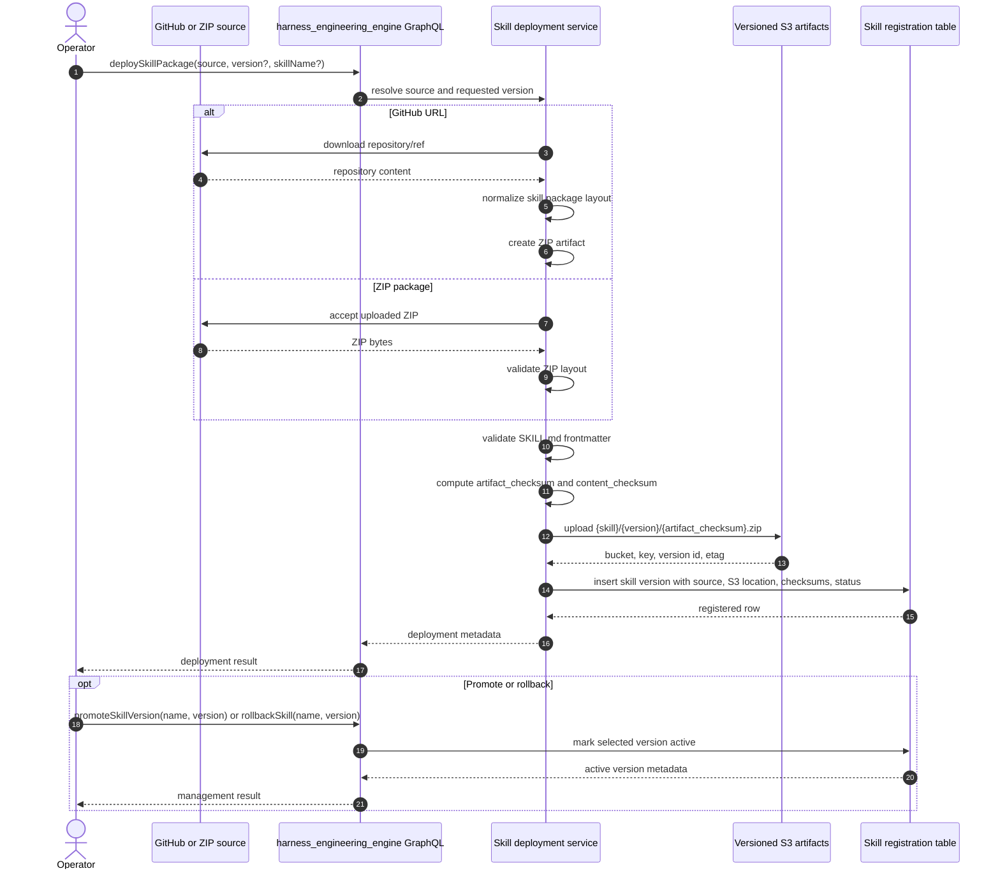
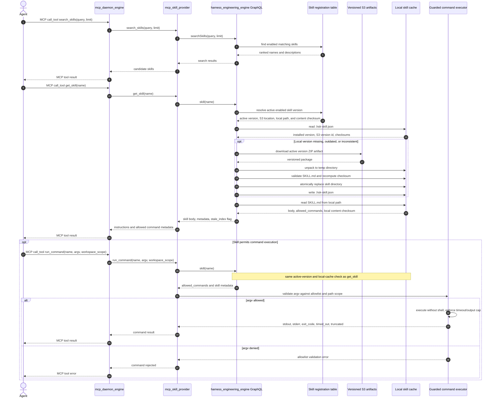
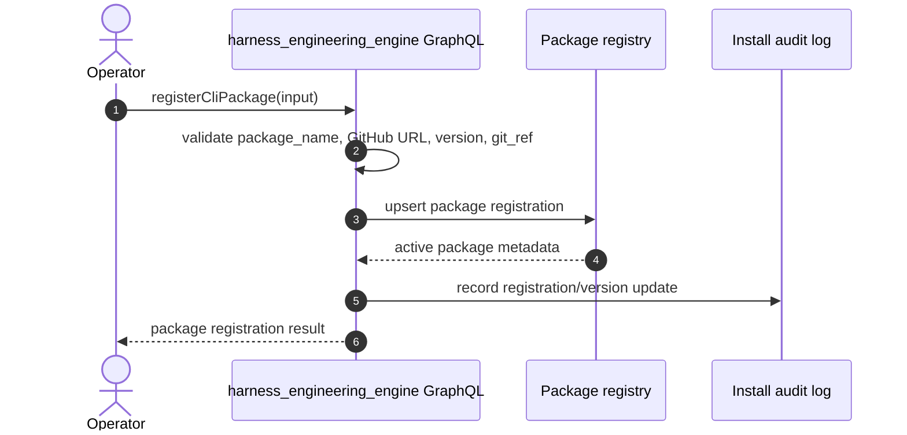
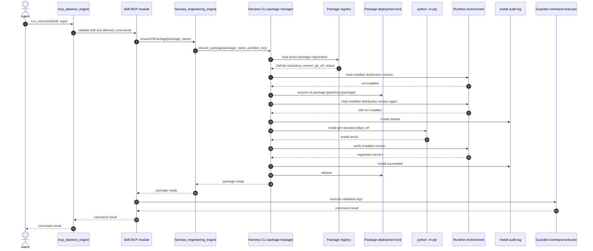
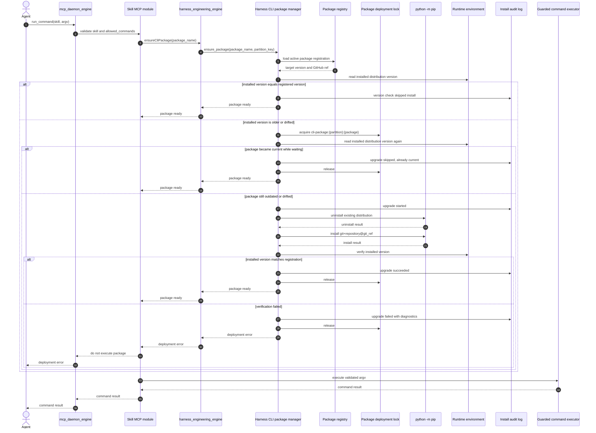

# Harness Engineering - Development Plan

> **Location:** `C:\Users\bibo7\gitrepo\silvaengine\harness_engineering_engine`
> **Date:** 2026-08-25
> **Status:** P1-P5 built and wired end to end; P6 partial; CLI package manager stubbed (v1.1)

### Implementation status

| Phase | Scope | State |
|---|---|---|
| P1 | Index model, `insertUpdateSkill`, `searchSkills`, `skill(name)` | Done - `skill(name)` now dispatches to on-demand refresh, see Known issue #1 (fixed) |
| P2 | `deploySkillPackage`, S3 artifact upload, checksums | Done - first version of a skill auto-activates, see Known issue #2 (fixed) |
| P3 | `refreshLocalSkills`, `registerSkills`, rollback/promote/disable/prune | Done |
| P4 | `mcp_skill_provider` module (`search_skills`, `get_skill`), built at `../mcp_skill_provider`, registered with `mcp_daemon_engine` | Done |
| P5 | `run_command` / guarded command executor | Done |
| P6 | Starter skills (`rfq-assistant`, `release-notes`) and templates | Partial - authoring/operator guides not yet written |
| v1.1 | Python CLI package manager (§11) | Stubbed - `CliPackageManager.ensure_package()` raises `NotImplementedError` by design; skills must use local scripts until this ships |

Test coverage today: `checksums`, `command_executor` (kill switch, allowlist match/reject, shell-metacharacter rejection, dry run), `config`, `skill_frontmatter`, `queries.skill::resolve_skill` (name dispatch, not-found handling, uuid fallback), and `skill_deployment` (first-version auto-activation). Not yet covered: full deployment happy path against a real GitHub source, refresh, registration, GraphQL mutations end to end, auth/tenant boundaries, MCP integration, and command-executor timeout/output-cap/path-traversal behavior (see §15).

### Known issues (found by tracing the code against this plan, now fixed)

1. **Fixed.** `skill(name)` did not return the skill body and never triggered on-demand S3 refresh. `handlers/skill_reader.py` already implemented exactly the logic this plan specifies (§7 "On-demand refresh", §9's return shape, the second mermaid sequence), but nothing in the GraphQL layer called it: `queries/skill.py::resolve_skill` called `get_repo("skill").resolve_single(info, **kwargs)`, a plain DB row fetch, and `types/skill.py::SkillType` had no `body`, `allowed_commands`, `cli_packages`, `local_content_checksum`, or `stale_index` field to carry that data even if it had. A second, independent bug compounded this: the `skill`/`skills` GraphQL fields declared their `name`/`description` arguments as `skill_name=String(name="name", ...)`, which in graphene sets the *GraphQL-facing* argument name but leaves the resolver's Python kwarg as `skill_name` — so `resolve_single`'s `kwargs.get("name")` and `list()`'s `filters.get("name")`/`filters.get("description")` never actually received a value, silently no-oping the name/description filters regardless of the wiring fix. **Applied:** `SkillType` now carries `body`, `allowed_commands`, `cli_packages`, `local_content_checksum`, `stale_index`; `resolve_skill` dispatches `name` lookups to `handlers.skill_reader.skill()` (returning `None` on `ValueError`/`FileNotFoundError`, propagating anything else) and falls back to the repo for `skill_uuid` lookups; `schema.py`'s `skill`/`skills` fields now declare `name`/`description` directly instead of aliasing through `skill_name`/`skill_description`. Covered by `tests/test_queries_skill.py`.
2. **Fixed.** A freshly deployed skill had no active version. `handlers/skill_deployment.py::deploy_skill_package` always inserted with `is_active=False` and `deployment_status="uploaded"`, while every agent-facing read path (`skill_reader._get_active_skill`, `refresh_local_skills`, `run_command`) filters on `is_active=True` - so `deploySkillPackage` alone never made a skill retrievable, even for a brand-new skill with no prior version to roll back from. **Applied:** `deploy_skill_package` now checks for an existing active version of the same skill name before registering; if none exists, the new version is inserted with `is_active=True` and `deployment_status="deployed"`, otherwise it lands inactive as before and still requires an explicit `promoteSkillVersion`. Covered by `tests/test_skill_deployment.py`.

---

## 0. Executive summary

This project is feasible as a controlled internal v1.

The simplified design avoids the expensive parts of the full runtime: no skill stack, no dynamic tool hot-swapping, no lifecycle table, no server-side context budgeting, and no per-provider handler changes. Instead, operators deploy skills from a GitHub URL or ZIP package into versioned S3 artifacts. The registration table records each skill's name, version, source reference, S3 location, checksums, deployment status, and searchable metadata. Local skill folders under `HSK_SKILL_ROOT` are refreshed from the registered S3 artifacts and used as the runtime cache. A skill MCP module is registered with `mcp_daemon_engine` so an agent can call `search_skills`, `get_skill`, and `run_command` through the existing MCP runtime.

The main feasibility risk is not the GraphQL or database work. The main risks are operational and security related:

- The engine must be able to refresh local skill folders from the registered S3 artifacts.
- `run_command` must be tightly constrained.
- Tenant/auth boundaries must be explicit.
- Search quality must be scoped to a simple v1.

With those constraints made explicit, the project is a reasonable 3-4 week build for a team already familiar with SilvaEngine conventions, S3 artifact handling, and `mcp_daemon_engine`. Add roughly one extra week if auth, deployment, or command-executor isolation patterns need to be created from scratch.

---

## 1. Target outcome

Give agents skills on demand without embedding a full runtime into the agent core.

The v1 system should let an agent:

1. Search a lightweight skill catalog.
2. Retrieve the full instructions for one selected skill.
3. Follow the skill's steps using already-available MCP tools.
4. Run a tightly allowlisted CLI command only when the skill explicitly permits it.
5. Validate and install an approved Python CLI package from GitHub when a skill depends on one.

The system should let operators:

1. Author skills as folders in source control.
2. Deploy skills from a GitHub URL or ZIP package into versioned S3 artifacts.
3. Register, refresh, roll back, disable, or prune skills without exposing the whole catalog to every agent.

---

## 2. Architecture

The system has three layers.

```text
harness_engineering_engine
  skills/ folder
    - SKILL.md and helper files are the local runtime cache
    - body, allowed_commands, templates, and scripts stay on disk

  database
    - stores registration, deployment, and searchable metadata
    - name, version, description, source, S3 artifact, checksum, deployment status, enabled

  GraphQL
    - deploySkillPackage
    - refreshLocalSkills
    - rollbackSkill
    - promoteSkillVersion
    - disableSkill
    - pruneSkillVersions
    - registerSkills
    - insertUpdateSkill
    - skills
    - searchSkills
    - skill

mcp_daemon_engine
  - existing gateway-dispatched MCP runtime
  - loads the `mcp_skill_provider` MCP module
  - exposes search_skills, get_skill, run_command as MCP tools
  - records tool calls through existing MCPFunctionCall flow

agent
  - invokes mcp_daemon_engine MCP endpoint
  - calls search_skills and get_skill
  - follows the instructions
  - calls other MCP tools or run_command as needed
```

S3 plus the registration table are the deployment source of truth. The database stores metadata and searchable fields, not full skill content. The local file system is the runtime cache used by `skill(name)` and `run_command`.

### Skill deployment sequence



### Skill request load and refresh sequence



---

## 3. Configuration

Do not hardcode the skill folder or command execution behavior. The engine and skill MCP module should load a small explicit configuration at startup.

| Setting | Required | Purpose |
|---|---:|---|
| `HSK_SKILL_ROOT` | Yes | Absolute or app-relative folder containing skill directories. This is the default root for registration and skill file reads. |
| `HSK_SKILL_ARTIFACT_BUCKET` | Yes for deployed skills | S3 bucket for versioned skill ZIP artifacts. |
| `HSK_SKILL_ARTIFACT_PREFIX` | No | S3 key prefix for skill artifacts, for example `skills/`. |
| `HSK_SKILL_LOCAL_METADATA_FILE` | No | Metadata filename stored in each local skill directory. Default `.hsk-skill.json`. |
| `HSK_SKILL_REFRESH_ON_STARTUP` | No | Whether startup compares local metadata with the registration table and S3 artifact metadata. |
| `HSK_ALLOW_UNREGISTERED_CHANGES` | No | Allows `skill(name)` to return a body when the local content checksum differs from the registered content checksum. Default `false` outside local development. |
| `HSK_RUN_COMMAND_ENABLED` | No | Global kill switch for guarded command execution. Default `false` until the executor is deployed and audited. |
| `HSK_RUN_COMMAND_DEFAULT_TIMEOUT_SECONDS` | No | Default timeout when an `allowed_commands` entry does not specify one. |
| `HSK_RUN_COMMAND_OUTPUT_LIMIT_BYTES` | No | Default stdout/stderr cap when an `allowed_commands` entry does not specify one. |
| `HSK_RUN_COMMAND_WORKSPACE_ROOT` | No | Optional workspace root used when `workspace_scope` is `workspace_dir`. |
| `HSK_DRY_RUN` | No | Resolve and validate `run_command` without executing it. Useful for tests and deployment checks. |

Configuration should be server-side and tenant-aware where needed. Agent-facing MCP tools must not accept arbitrary filesystem roots, environment variables, or execution policy overrides.

`registerSkills(root, prune)` may accept a `root` argument for admin workflows, but the resolver must normalize it and reject paths outside configured skill roots. The normal deploy path should use `HSK_SKILL_ROOT` directly after local skills have been refreshed from registered S3 artifacts.

---

## 4. What changes from the full plan

| Area | Full runtime plan | Simplified v1 |
|---|---|---|
| Skill source | Uploaded package / runtime-managed skill | GitHub URL or ZIP package promoted to versioned S3 artifact |
| Skill storage | DB may hold full body and runtime metadata | S3 stores versioned packages; DB stores registration index; local disk stores runtime cache |
| Retrieval | Runtime catalog plus skill stack | GraphQL search and get |
| Agent integration | Handler changes and enabled-tool updates | Skill MCP module in `mcp_daemon_engine` |
| Tool control | Per-skill tool hot-swap | Fixed tools; skill text names which tools to use |
| State tracking | `skill_tasks`, steps, completion state | Conversation state only |
| Context control | Server-managed budget/lifecycle | Agent chooses what to retrieve |
| CLI execution | Managed as part of runtime | One guarded `run_command` tool behind `mcp_daemon_engine` |
| Estimated build | 8-10 weeks | 3-4 weeks, assuming existing patterns |

Use the simplified plan when skills are runnable playbooks. Use the full plan only when the platform needs server-enforced orchestration, automatic tool narrowing, step lifecycle tracking, or context-budget management.

---

## 5. Skill format

Each skill is a directory under the configured `HSK_SKILL_ROOT`. Each directory must contain a `SKILL.md`.

```text
harness_engineering_engine/
  skills/
    rfq-assistant/
      SKILL.md
      intake_questionnaire.md
      scripts/
        build_quote.py
    invoice-reconcile/
      SKILL.md
    release-notes/
      SKILL.md
      template.md
```

`SKILL.md` uses YAML frontmatter plus a markdown instruction body.

```markdown
---
name: rfq-assistant
description: >
  RFQ collection and quotation workflow. Use when the user needs a price quote
  for one or more products, especially with multi-supplier negotiation.
allowed_commands:
  - argv: ["python", "scripts/build_quote.py", "--spec", "*.json"]
---

You are an RFQ assistant. Work through the steps below.

## Steps

1. Collect product specifications using `intake_questionnaire.md`.
2. Search the supplier catalog with `rfq.search_product(name)`.
3. Build the quote with `run_command`.
4. File the quote with `rfq.create_quote(...)`.
5. Present the quote and ask the user to accept, reject, or negotiate.

## Conventions

- Always confirm units of measure and currency.
- Prefer an MCP tool when one exists.
- Use `run_command` only for approved command-line tools.
```

Required frontmatter fields:

| Field | Required | Purpose |
|---|---:|---|
| `name` | Yes | Stable public skill identifier. Unique per tenant/partition. |
| `description` | Yes | Searchable summary and usage guidance. |
| `allowed_commands` | No | Structured argv allowlist for `run_command`. If omitted, the skill is read-only. |

Recommendation: use structured `allowed_commands` entries rather than shell-like strings. This avoids ambiguity around quoting, redirection, pipes, and path traversal.

---

## 6. Database model

The v1 database has one new model: `Skill`.

The database stores registration and deployment metadata only. It does not store the full skill body, helper files, templates, or scripts. Versioned ZIP artifacts live in S3, and the local skill directory is a runtime cache.

| Column | Purpose |
|---|---|
| `partition_key` | Tenant/partition isolation, following SilvaEngine conventions. |
| `skill_uuid` | Stable row id within the partition. Composite primary key with `partition_key`. |
| `endpoint_id`, `part_id` | SilvaEngine gateway tenant metadata carried alongside `partition_key`. |
| `name` | Public identifier, unique per partition. |
| `version` | Version identifier for the deployed skill package. |
| `description` | Searchable description. |
| `source_type` | `github` or `zip`. |
| `source_ref` | GitHub URL, commit/ref, original ZIP name, or other operator-provided source reference. |
| `s3_bucket` | Bucket containing the versioned ZIP artifact. |
| `s3_key` | Key for the versioned ZIP artifact. |
| `s3_version_id` | S3 object version id when bucket versioning is enabled. |
| `artifact_checksum` | Hash of the uploaded ZIP artifact. |
| `content_checksum` | Hash of the unpacked skill folder content. |
| `local_path` | Runtime cache path under `HSK_SKILL_ROOT`. Populated by `registerSkills`, not by `deploySkillPackage`. |
| `deployment_status` | `uploaded`, `registered`, `deployed`, `failed`, `disabled`, or `rolled_back`. |
| `enabled` | Soft enable/disable flag, set by `disableSkill`/`pruneSkillVersions`. |
| `is_active` | Whether this version is the one served to agents. `deploySkillPackage` sets `is_active=true` for a skill's first-ever version and `false` for later versions of an already-active skill; `promoteSkillVersion`/`rollbackSkill` set it explicitly otherwise. Exactly one version per skill should be active at a time. |
| `registered_at` | When this version was registered. |
| `created_at`, `updated_by`, `updated_at` | Bookkeeping. `updated_by` is a required argument on every management mutation. |

### Feasibility constraint

For v1, choose one of these local runtime cache assumptions and document it explicitly:

| Option | Feasibility | Notes |
|---|---|---|
| Single engine host | Lowest risk | Startup refresh downloads S3 artifacts into local `HSK_SKILL_ROOT`. |
| Shared mounted volume | Feasible | All engine instances can share the refreshed runtime cache. |
| Per-instance local cache | Feasible | Every instance must run startup or scheduled refresh and validate local metadata. |

If the engine runs on multiple instances without shared storage, raw local paths are not a deployment source of truth. Treat S3 plus the registration table as authoritative, and treat local directories as disposable caches.

---

## 7. Skill deployment and management

Deployed skills should be versioned package artifacts. Operators can provide either a GitHub repository URL or a ZIP package.

### Deploy skills

```text
deploySkillPackage(source, version?, skill_name?)
  -> accept a GitHub repository URL or ZIP package
  -> if GitHub, download the repository content at the requested ref
  -> normalize package layout and create a ZIP if needed
  -> validate that each skill has SKILL.md with required frontmatter
  -> compute artifact_checksum and content_checksum
  -> upload ZIP to S3 as a versioned artifact
  -> register each skill version in the Skill table
  -> mark deployment_status as uploaded or registered
```

`deploySkillPackage` auto-activates a skill's first-ever version (`is_active=true`, `deployment_status="deployed"`), so a brand-new skill is retrievable immediately after deploy. Every version after that still lands inactive (`is_active=false`, `deployment_status="uploaded"`) and requires an explicit `promoteSkillVersion` before `skill(name)`, `run_command`, or `refreshLocalSkills` will see it (see Known issue #2 above, fixed).

S3 key format should make rollback and inspection simple:

```text
s3://{HSK_SKILL_ARTIFACT_BUCKET}/{HSK_SKILL_ARTIFACT_PREFIX}/{skill_name}/{version}/{artifact_checksum}.zip
```

If S3 bucket versioning is enabled, store both the logical `version` and the returned `s3_version_id`. The logical version is operator-facing; the S3 version id uniquely identifies the stored object.

### Local metadata

Each installed skill directory should include local metadata, defaulting to `.hsk-skill.json`.

```json
{
  "name": "rfq-assistant",
  "version": "2026.08.24.1",
  "source_type": "github",
  "source_ref": "https://github.com/example/skills.git#main",
  "s3_bucket": "example-skill-artifacts",
  "s3_key": "skills/rfq-assistant/2026.08.24.1/abc123.zip",
  "s3_version_id": "3HL4kqtJlcpXrof3A6d...",
  "artifact_checksum": "abc123",
  "content_checksum": "def456",
  "last_refresh_at": "2026-08-24T12:00:00Z"
}
```

This file is not authoritative. It is a fast local comparison point used during startup, explicit refresh, and on-demand skill retrieval.

### Startup and refresh

```text
refreshLocalSkills()
  -> query enabled registered skill versions
  -> read local .hsk-skill.json files under HSK_SKILL_ROOT
  -> compare name, version, artifact checksum, content checksum, and S3 version id
  -> download the registered ZIP from S3 if local metadata is missing, outdated, or inconsistent
  -> unpack into a temporary directory
  -> validate SKILL.md and recompute content checksum
  -> atomically replace the local skill directory
  -> write .hsk-skill.json
  -> mark deployment_status as deployed or failed
```

Refresh should be safe to run repeatedly. Failed refreshes must not leave a partial skill directory active; keep the previous valid version until the new version is fully unpacked and validated.

### On-demand refresh

`skill(name)` must verify that the local runtime cache matches the active registered version before it returns `SKILL.md`.

```text
skill(name)
  -> resolve the active enabled registration row
  -> read local .hsk-skill.json from the expected skill directory
  -> compare name, version, artifact checksum, content checksum, and S3 version id
  -> if local metadata is missing, outdated, or inconsistent, download the active S3 artifact
  -> unpack and validate into a temporary directory
  -> atomically replace the local skill directory
  -> write .hsk-skill.json
  -> read SKILL.md and return the skill body
```

This makes rollback a management-state change. The next `skill(name)` or `run_command(name, ...)` request observes the active registered version, compares it to local metadata, and refreshes from S3 if the local directory is not current.

### Rollback

Rollback should only select a previous registered version as the active version for the skill. It should not directly mutate local skill directories. Do not mutate or overwrite historical S3 artifacts.

```text
rollbackSkill(name, version)
  -> verify the requested version exists and is enabled
  -> mark the requested version as active
  -> mark the previous active version as inactive or superseded
  -> set deployment_status to rolled_back for management visibility
  -> return the selected active version metadata
```

### Management operations

Management operations should act on registration rows and never require agents to list the full catalog.

| Operation | Purpose |
|---|---|
| `skills(enabled?, name?)` | Admin catalog view across registered versions and deployment statuses. |
| `disableSkill(name, version?)` | Disable a specific version or the whole skill so it no longer appears in `searchSkills`. |
| `promoteSkillVersion(name, version)` | Mark a registered version as the active version. Local disk updates on the next `skill(name)`, `run_command`, or explicit refresh. |
| `pruneSkillVersions(name, keep)` | Disable or archive old registration rows while keeping immutable S3 artifacts. |

---

## 8. Registration

`registerSkills` is a GraphQL mutation or engine job. It scans `HSK_SKILL_ROOT` by default, reads frontmatter and local metadata, validates the skill, computes a content checksum, and upserts the searchable index fields for the installed version.

```text
registerSkills(root, prune)
  -> resolve root against configured skill roots
  -> reject root if outside the configured allowlist
  -> scan root for */SKILL.md
  -> read local .hsk-skill.json when present
  -> parse YAML frontmatter
  -> validate name, description, allowed_commands
  -> compute content_checksum
  -> insertUpdateSkill(name, version, description, local_path, s3 location, checksums, deployment_status, enabled)
  -> optionally disable rows whose folders no longer exist
```

Registration should be idempotent. If the checksum has not changed, the job can skip the row.

### Important drift rule

The plan intentionally allows live file reads, so body edits can take effect without re-registration. That is convenient, but it creates possible drift between the DB index and disk.

Mitigation for v1:

- `skill(name)` should return the current local content checksum with the body.
- If the local content checksum differs from the registered `content_checksum`, include a `stale_index: true` flag.
- In strict environments, reject stale reads unless an operator has enabled `allow_unregistered_changes`.

This keeps local development fast while giving production a clear safety switch.

---

## 9. GraphQL surface

The engine owns the GraphQL contract.

| Operation | Type | Consumer | Purpose |
|---|---|---|---|
| `deploySkillPackage(source, version, skillName?)` | Mutation/job | Admin, CI, deploy hook | Accept GitHub URL or ZIP, upload a versioned artifact to S3, and create registration rows. |
| `refreshLocalSkills()` | Mutation/job | Admin, startup, deploy hook | Proactively compare local metadata to registration/S3 state and refresh local skill directories. |
| `rollbackSkill(name, version)` | Mutation/job | Admin/operator only | Select a previous registered version as active. Local disk updates on the next skill request or explicit refresh. |
| `promoteSkillVersion(name, version)` | Mutation/job | Admin/operator only | Mark a registered version as the active version. |
| `disableSkill(name, version?)` | Mutation | Admin/operator only | Disable a skill or skill version from search/retrieval. |
| `pruneSkillVersions(name, keep)` | Mutation/job | Admin/operator only | Disable or archive old rows without deleting immutable S3 artifacts. |
| `registerSkills(root, prune)` | Mutation/job | Admin, CI, deploy hook | Scan installed folders and refresh searchable index fields. |
| `insertUpdateSkill(input)` | Mutation | Admin/job | Upsert one index row. |
| `skills(enabled)` | Query | Management only | Show the full catalog. Not exposed as an agent MCP tool. |
| `searchSkills(query, limit)` | Query | Agent through MCP | Return ranked `name` and `description` matches. |
| `skill(name)` | Query | Agent through MCP | Resolve the active version, refresh local cache from S3 if needed, read `SKILL.md`, and return body, metadata, and allowlist. |

`skill(name)` should return:

```text
name
version
description
body
allowed_commands
local_path
source_type
source_ref
s3_bucket
s3_key
s3_version_id
artifact_checksum
content_checksum
local_content_checksum
stale_index
deployment_status
updated_at
```

### Search scope

Use lexical search for v1:

- Match on `name` and `description`.
- Return a small default limit, for example 5 or 10.
- Rank exact name matches first, then prefix/name matches, then description matches.

Embeddings can be added later if the catalog grows large enough to justify them.

---

## 10. MCP daemon integration

Use the existing `mcp_daemon_engine` runtime as the agent-facing integration point. The sibling package already exposes gateway dispatch functions such as `dispatch_mcp`, `dispatch_graphql`, and `dispatch_mcp_async`; the skill tools should be delivered as an MCP module loaded into that runtime, not as a separate processor service.

The skill MCP module (`mcp_skill_provider`) holds no skill data of its own. It invokes the `harness_engineering_engine` GraphQL surface for discovery and retrieval, then delegates command execution to a small guarded command executor only for `run_command`.

| MCP tool | Implementation | Returns |
|---|---|---|
| `search_skills(query, limit?)` | MCP tool in `mcp_skill_provider`. Calls Harness `searchSkills`. | Ranked skill names and descriptions. |
| `get_skill(name)` | MCP tool in `mcp_skill_provider`. Calls Harness `skill(name)`. | Plain-text instructions and metadata. |
| `run_command(name, argv, workspace_scope?)` | MCP tool in `mcp_skill_provider`. Calls Harness `skill(name)` for allowlist, then uses the guarded command executor. | `stdout`, `stderr`, `exit_code`, `timed_out`, `truncated`. |

Do not expose `list_skills` as an agent tool in v1. A full catalog dump is a management function and can waste context.

### MCP module registration

Register `mcp_skill_provider` through `mcp_daemon_engine` using its existing module/function metadata flow. The expected deployment path is:

```text
loadMcpConfiguration
  -> registers the module as mcp_skill_provider
  -> registers tools: search_skills, get_skill, run_command
  -> mcp_daemon_engine lists and calls those tools through its MCP endpoint
```

The agent should call `mcp_daemon_engine` using the normal MCP JSON-RPC path. Tenant identity should come from the gateway-provided `endpoint_id`, `part_id`, `partition_key`, and `context.user`, matching the existing daemon pattern.

#### Package layout

`mcp_skill_provider` is a standalone Python package, not part of `harness_engineering_engine`. It is built at `../mcp_skill_provider` (a sibling repo alongside `mcp_daemon_engine` under `silvaengine`):

```
mcp_skill_provider/
  __init__.py
  mcp_skill_provider.py       # MCPSkillProvider entry point, composes the mixins below
  skill_mixin.py               # search_skills, get_skill
  command_mixin.py             # run_command
  graphql_backed_processor.py  # Shared base: dispatches through harness_engineering_engine GraphQL
  graphql_client.py            # Internal GraphQL calls to harness_engineering_engine
  error_handler.py             # MCP-facing error normalization
  mcp_configuration.py         # loadMcpConfiguration manifest
```

`skill_mixin.py` and `command_mixin.py` expose the three MCP tools as methods on `MCPSkillProvider`, each built on `GraphQLBackedProcessor` so they inherit a common dispatch path to `harness_engineering_engine`. The module is registered with `mcp_daemon_engine` via the standard `loadMcpConfiguration` flow described above.

---

## 11. Command execution security

`run_command` is the sharp edge of the system. Treat the subprocess portion as a separate security-sensitive component called the guarded command executor.

The guarded command executor is not an agent-facing service. It is a small internal helper used only by the skill MCP module after `run_command(name, argv, workspace_scope?)` has fetched the named skill and confirmed that the requested argv matches that skill's `allowed_commands`.

V1 rules:

| Guard | Requirement |
|---|---|
| Deny by default | If no `allowed_commands` exist, no command can run. |
| Structured argv | Accept an argv array, not a shell string. |
| No shell | Never invoke through `sh`, `bash`, `cmd`, or PowerShell unless the specific executable is intentionally allowlisted. |
| One process | No pipes, redirects, command separators, backticks, or command substitution. |
| Path normalization | Resolve script paths and file arguments before execution. Reject paths outside approved roots. |
| Working directory | Default to the skill directory. Do not accept arbitrary `cwd`. |
| Workspace scope | If needed, allow only configured scopes such as `skill_dir`, `workspace_dir`, or a per-tenant work directory. |
| Timeout | Enforce a wall-clock timeout and kill the process group on overrun. |
| Output cap | Truncate stdout/stderr before returning to the agent. |
| Environment control | Provide a minimal environment. Do not pass secrets by default. |
| Audit log | Log skill name, argv, caller, tenant, start/end time, exit code, timeout, and truncation. |
| Dry run | `HSK_DRY_RUN=1` returns the resolved command without executing it. |

Do not rely on the allowlist alone. For stronger isolation, run `mcp_daemon_engine` or the command executor under a restricted user or inside a container with limited filesystem and network access.

### Python CLI package dependencies (v1.1 - deferred)

> This subsection, including both sequence diagrams below, is a target design for v1.1, not delivered v1 scope. `handlers/cli_package_manager.py` ships as a documented stub: `CliPackageManager.ensure_package()` raises `NotImplementedError` on every call. Until the package registry table and install flow are built, skills that need a CLI dependency must vendor a helper script under their own skill folder (`allowed_commands` pointing at `scripts/*.py`) instead of declaring `cli_packages`.

A skill may either run a helper script under its own skill folder or use a registered Python CLI package. Registered Python CLI packages are centrally versioned in the database and installed from GitHub at runtime only after validation.

The Python CLI package manager is part of `harness_engineering_engine`. It owns package registration, database reads, deployment locks, pip install/uninstall calls, installed-version verification, and installation audit logs. The skill MCP module does not manage packages directly; it asks Harness to validate package readiness before command execution.

Package registration should include:

| Field | Purpose |
|---|---|
| `package_name` | Unique Python CLI package identifier within the tenant or partition. |
| `github_repository_url` | Source repository used to install the package. |
| `version` | Current approved package version. |
| `git_ref` | Tag, release, branch, or commit used for installation. Prefer tags or commits. |
| `description` | Optional description of the package and purpose. |
| `status` | Whether the package is active and available for deployment. |
| `updated_at` | Last registration or version update timestamp. |

Runtime package validation:

- Every Python CLI package must be registered with package name, GitHub repository URL, approved version, optional description, active status, and updated timestamp.
- Runtime execution must load the registered package metadata and compare the locally installed package version with the registered version before running the command.
- Missing packages are installed from the registered GitHub ref, then verified before the original request continues.
- Outdated packages are locked, uninstalled, reinstalled from the registered GitHub ref, then verified before the original request continues.
- Matching versions require no installation action.
- Install and upgrade operations must use a package-level distributed lock so concurrent requests do not race. After acquiring the lock, the worker must check the installed version again before changing the environment.
- Installation and verification failures must be logged and must block package execution.
- Production registrations should point at a Git tag, release, or commit instead of the default branch.

Installation audit logs should record package name, previous version, target version, GitHub repository and ref, installation timestamp, operation status, and error details when applicable.

#### CLI package registration sequence



#### Missing CLI package install sequence



#### CLI package upgrade and current-version sequence



Recommended skill frontmatter:

```yaml
cli_packages:
  - package_name: ingredients-optimization-agent
    distribution_name: ingredients-optimization-agent
    command: ingredients-optimization-agent
allowed_commands:
  - argv: ["ingredients-optimization-agent", "optimize", "--input", "*.json"]
    timeout_seconds: 60
    output_limit_bytes: 50000
```

Before `run_command` executes a CLI package command, the skill module should call `harness_engineering_engine` to ensure the active registered version is installed and verified. Harness then delegates internally to its CLI package manager service.

The expected package shape is an adjacent Python CLI package such as:

```text
../ingredients_optimization_agent/
  pyproject.toml
  README.md
  ingredients_optimization_agent/
    __init__.py
    ...
```

The deployment mechanism must not depend on the package being adjacent at runtime. Local adjacency is only a development convenience. Production installs should use the registered GitHub repository URL and a version-specific `git_ref`.

The package manager should read the package's distribution metadata from the installed environment, not from the source folder. For example, if the repository folder is `ingredients_optimization_agent`, the installable distribution may still be named `ingredients-optimization-agent`, and that distribution name is what `importlib.metadata.version()` must verify.

### Recommended command schema

Prefer this:

```yaml
allowed_commands:
  - argv: ["python", "scripts/build_quote.py", "--spec", "*.json"]
    timeout_seconds: 30
    output_limit_bytes: 20000
```

Avoid this:

```yaml
allowed_commands:
  - "python scripts/build_quote.py *"
```

String globs are easier to bypass and harder to validate consistently across operating systems.

---

## 12. Authorization and tenancy

The plan should explicitly define permissions before implementation.

Suggested v1 policy:

| Operation | Required permission |
|---|---|
| `deploySkillPackage` | Admin/operator only. |
| `refreshLocalSkills` | Admin/operator or trusted startup job only. |
| `rollbackSkill` | Admin/operator only. |
| `promoteSkillVersion` | Admin/operator only. |
| `disableSkill` | Admin/operator only. |
| `pruneSkillVersions` | Admin/operator only. |
| `registerSkills` | Admin/operator only. |
| `insertUpdateSkill` | Admin/operator only. |
| `skills` | Admin/operator only. |
| `searchSkills` | Agent or user with tenant-scoped read access. |
| `skill(name)` | Agent or user with tenant-scoped read access. |
| `run_command` | Agent or user with tenant-scoped execute access, plus skill allowlist match. |

Every GraphQL resolver must derive `partition_key` from authenticated context, not from arbitrary user input.

The skill MCP module should not be able to request a different tenant by passing a parameter. It should inherit tenant identity from `mcp_daemon_engine` and the gateway request context.

---

## 13. Components to build

| # | Component | Scope | Effort |
|---|---|---|---|
| 1 | `Skill` model and migration | One index table, dual PG/DDB through `get_repo()` if required by SilvaEngine conventions. | S |
| 2 | GraphQL queries/mutations | `deploySkillPackage`, `refreshLocalSkills`, `rollbackSkill`, `promoteSkillVersion`, `disableSkill`, `pruneSkillVersions`, `skills`, `searchSkills`, `skill`, `insertUpdateSkill`, `registerSkills`. | M-L |
| 3 | Deployment service | GitHub/ZIP intake, ZIP normalization, S3 upload, artifact/version metadata, rollback selection. | M |
| 4 | Registration service | Folder scanning, frontmatter parsing, local metadata parsing, validation, checksum, prune behavior. | M |
| 5 | Local refresh service | Compare local metadata to registration/S3 state, download artifacts, unpack, validate, atomic replacement. | M |
| 6 | File-backed skill reader | Resolve local path, read `SKILL.md`, split frontmatter/body, detect checksum drift. | S-M |
| 7 | Skill MCP module | `search_skills`, `get_skill`, `run_command` tool schemas, `mcp_daemon_engine` registration, and GraphQL client. | M |
| 8 | Guarded command executor | Structured argv validation, path scoping, timeout, output cap, audit logging, dry run. | M |
| 9 | Python CLI package manager (v1.1) | `harness_engineering_engine` service for package registration, GitHub ref installation, version validation, package-level deployment lock, upgrade flow, and install audit logs. Not part of the P1-P6 delivery plan below; ships as a stub in v1. | M |
| 10 | Configuration loader | `HSK_SKILL_ROOT`, S3 artifact config, drift policy, command-executor defaults, CLI package defaults, and execution kill switch. | S |
| 11 | Starter skills and docs | 2-3 real skills, template, authoring README, operational README. | S |

Suggested layout:

```text
harness_engineering_engine/
  __init__.py
  main.py
  schema.py
  py.typed
  handlers/
    __init__.py
    config.py                # Centralized Config class (like rfq_engine)
    checksums.py             # Content / artifact checksums
    command_executor.py      # Guarded run_command
    cli_package_manager.py   # CLI package registration/install (v1.1)
    skill_deployment.py      # deploySkillPackage — GitHub/ZIP intake + S3 + register
    skill_frontmatter.py     # YAML frontmatter parser
    skill_path.py            # Guarded filesystem helpers
    skill_reader.py          # skill(name) — on-demand refresh + body retrieval
    skill_refresh.py         # refreshLocalSkills — S3 download + atomic replace
    skill_registration.py    # registerSkills — scan + upsert
  models/
    __init__.py
    dynamodb/
      __init__.py
      cache.py
      skill.py
      utils.py
    postgresql/
      __init__.py
      base.py
      skill.py
      utils.py
    repositories/
      __init__.py
      base.py
      dispatch.py
      dynamodb/
        __init__.py
        _base.py
        skill_repo.py
      postgresql/
        __init__.py
        skill_repo.py
  queries/
    __init__.py
    skill.py                 # resolve_skill, resolve_skill_list, resolve_search_skills
  mutations/
    __init__.py
    skill.py                 # InsertUpdateSkill, DeleteSkill
    skill_management.py      # DeploySkillPackage, RefreshLocalSkills, RegisterSkills,
                             #  PromoteSkillVersion, RollbackSkill, DisableSkill,
                             #  PruneSkillVersions, RunCommand
  types/
    __init__.py
    skill.py                 # SkillType, SkillListType
  utils/
    __init__.py
    normalization.py         # normalize_to_json
    rls.py                   # PostgreSQL RLS helpers
  skills/
    rfq-assistant/
      SKILL.md
      intake_questionnaire.md
    release-notes/
      SKILL.md
      template.md
  tests/
    __init__.py
    test_checksums.py
    test_command_executor.py
    test_config.py
    test_frontmatter.py
migration/
  alembic.ini
  alembic/
    env.py
    versions/
      0001_create_skills.py

mcp_daemon_engine/
  # existing sibling package
  # loads the skill tools as a normal MCP module/function configuration
```

---

## 14. Delivery plan

### P1 - Read-only vertical slice

**Duration:** 4-5 days

Deliver:

- Configuration loader for `HSK_SKILL_ROOT`, S3 artifact settings, and stale-index policy.
- `Skill` index model and migration.
- `insertUpdateSkill`.
- `searchSkills`.
- `skill(name)` reading from disk.
- On-demand local version check in `skill(name)`.
- One sample read-only skill.

Exit criteria:

- A GraphQL caller can upsert a skill index row.
- `searchSkills` returns the sample skill.
- `skill(name)` returns the live body from `SKILL.md`.
- If the local skill directory is missing or stale, `skill(name)` refreshes the active registered version from S3 before returning.
- Skill file reads are constrained to `HSK_SKILL_ROOT`.
- Tests cover missing skill, disabled skill, malformed frontmatter, and stale checksum.

### P2 - Skill deployment and package management

**Duration:** 4-6 days

Deliver:

- `deploySkillPackage` for GitHub URL and ZIP package sources.
- Versioned ZIP upload to S3.
- Artifact checksum and unpacked content checksum computation.
- Registration table fields for source, version, S3 location, checksum, status, and timestamps.
- `.hsk-skill.json` local metadata format.

Exit criteria:

- A GitHub URL can be downloaded, packaged as ZIP, uploaded to S3, and registered as a skill version.
- A provided ZIP can be uploaded to S3 and registered as a skill version.
- Each uploaded artifact has a unique S3 key and checksum.
- Registration rows include name, version, source reference, S3 location, checksums, deployment status, and registration timestamp.
- A skill's first-ever deployed version is visible to `skill(name)` and `run_command` immediately. Every version deployed after that stays inactive until an operator calls `promoteSkillVersion`; document this two-step (deploy, then promote) for upgrades in the P6 operator guide.

### P3 - Local refresh and registration

**Duration:** 3-4 days

Deliver:

- `refreshLocalSkills`.
- `registerSkills`.
- Folder scan and validation.
- Local metadata comparison.
- S3 artifact download and atomic local refresh.
- Checksum handling.
- `prune` behavior.
- Management-only `skills` query.

Exit criteria:

- Startup or refresh detects missing, outdated, or inconsistent local skill directories.
- The correct version is downloaded from S3 and installed under `HSK_SKILL_ROOT`.
- Local `.hsk-skill.json` is written with installed version, checksum, source reference, and last refresh time.
- Rollback changes only the active registered version; local disk changes on the next skill request or explicit refresh.
- Running `registerSkills` after editing frontmatter updates the DB index.
- Removing a folder disables or prunes the row according to the selected option.
- Duplicate names in a partition are rejected.

### P4 - MCP daemon skill module

**Duration:** 2-3 days

Deliver:

- `mcp_skill_provider` MCP module.
- `mcp_daemon_engine` module/function registration.
- `search_skills`.
- `get_skill`.
- GraphQL client configuration.

Exit criteria:

- An MCP client can invoke `mcp_daemon_engine` and call `search_skills` and `get_skill` end to end.
- The skill module never lists the full catalog.
- Tenant identity is inherited from `mcp_daemon_engine` and the gateway request context.

### P5 - Guarded command executor

**Duration:** 3-5 days

Deliver:

- `run_command`.
- `HSK_RUN_COMMAND_ENABLED` kill switch.
- Structured argv allowlist matching.
- Path normalization and workspace scoping.
- Timeout, output cap, dry run, and audit logs.

Exit criteria:

- An allowlisted command runs successfully.
- Non-allowlisted commands are refused.
- Shell features are rejected.
- Path traversal attempts are rejected.
- Timeout and output truncation are tested.
- Command execution is denied when `HSK_RUN_COMMAND_ENABLED` is false.

### P6 - Authoring kit and operational docs

**Duration:** 1-2 days

Deliver:

- 2-3 real skills.
- `SKILL.md` template.
- Authoring guide.
- Operator guide for GitHub/ZIP deployment, registration, refresh, rollback, and troubleshooting.

Exit criteria:

- A new author can create a skill, register it, retrieve it from MCP, and execute an allowed command if present.
- An operator can deploy a skill version, refresh local runtime state, and roll back to a previous version.

### P7 - Python CLI package manager (v1.1, not scheduled)

Not part of this delivery plan. Tracked separately once package-registry demand is confirmed; see §11 for the target design and §16 for feasibility notes. Until then, `ensure_package()` remains a documented `NotImplementedError` stub and skills depending on a CLI package should fall back to a vendored helper script.

---

## 15. Testing strategy

Minimum test coverage for v1:

| Area | Tests | Status |
|---|---|---|
| Frontmatter parsing | Required fields, malformed YAML, duplicate names, optional `allowed_commands`. | Done (`test_frontmatter.py`) |
| Configuration | Missing `HSK_SKILL_ROOT`, missing S3 artifact config, invalid roots, root traversal, environment-specific defaults. | Done (`test_config.py`) |
| Checksums | Artifact and content checksum computation. | Done (`test_checksums.py`) |
| Command executor | Allowlisted argv accepted, unmatched argv rejected, shell syntax rejected, kill switch, glob match, dry run. | Partial (`test_command_executor.py`) - path traversal, timeout, and output-cap cases still missing |
| Deployment | GitHub source packaging, ZIP upload, S3 key/version uniqueness, artifact checksum, registration metadata, rollback target selection. | Outstanding |
| Local refresh | Missing metadata, outdated version, checksum mismatch, failed download, failed validation, atomic replacement, previous version preserved on failure. | Outstanding |
| On-demand refresh | `skill(name)` compares local metadata with the active registration row, downloads the active S3 version when needed, and returns the refreshed body. | Outstanding |
| Rollback | `rollbackSkill` only changes active registration state; subsequent `skill(name)` or `refreshLocalSkills` picks up the selected version. | Outstanding |
| Registration | Idempotent registration, checksum changes, local metadata parsing, prune behavior, disabled rows. | Outstanding |
| Search | Exact name match, description match, disabled skill excluded, limit respected. | Outstanding |
| Retrieval | Missing file, unreadable file, stale checksum, helper file references. | Outstanding |
| Auth/tenant | Cross-tenant access rejected, management operations restricted. | Outstanding |
| MCP integration | Agent invokes `mcp_daemon_engine`; skill module handles `search_skills -> get_skill -> run_command` happy path. | Outstanding |

The command executor tests are the highest priority because they protect the dangerous behavior; closing the path-traversal, timeout, and output-cap gaps above should come before enabling `HSK_RUN_COMMAND_ENABLED` in any shared environment.

---

## 16. Feasibility assessment

### Feasible now

- Folder-authored skills.
- Versioned S3 skill artifacts.
- Database registration index.
- Local runtime cache under `HSK_SKILL_ROOT`.
- GraphQL registration/search/retrieval.
- Skill MCP module loaded by `mcp_daemon_engine` for search/get.
- Guarded command execution for trusted internal skills.

### Feasible with explicit constraints

- Multi-instance deployment, if every instance refreshes from S3 or all instances share the same refreshed skill volume.
- Multi-tenant usage, if every resolver derives partition identity from authenticated context.
- Command execution, if the guarded executor uses structured argv allowlists and strong path scoping.

### Defer

- Python CLI package auto-install (§11) - stub ships in v1; local skill scripts cover the same need until the package registry, install locking, and audit logging are built.
- Embedding search.
- Skill signing.
- File watcher auto-registration.
- Runtime lifecycle table.
- Dynamic tool narrowing.
- Per-provider handler changes.

---

## 17. Recommendation

Proceed with the simplified plan, but make the v1 contract stricter:

1. Treat read-only search/get as the first milestone.
2. Treat S3 artifacts plus the registration table as the deployment source of truth.
3. Replace shell-style `allowed_commands` with structured argv allowlists.
4. Remove arbitrary `cwd` from `run_command`.
5. Add auth/tenant rules to the GraphQL schema before exposing MCP tools.
6. Add audit logging for every command execution.
7. Put skill roots and command-executor policy behind server-side configuration.
8. Refresh local skill directories from registered S3 versions at startup or through an explicit admin refresh.

Items 1-4 and 7-8 are implemented (see the Implementation status table at the top of this document; items 1 and 2 required the Known-issues fixes above). The remaining gap before wider rollout is test coverage, not architecture: close the path-traversal/timeout/output-cap tests on the command executor and add coverage for deployment, refresh, registration, retrieval, auth/tenant, and MCP integration per §15, and confirm item 5 (auth/tenant rules) against the actual resolver code rather than assuming it from the schema shape.

This keeps the project lightweight while addressing the risks that would otherwise make the simplified architecture fragile in production.
